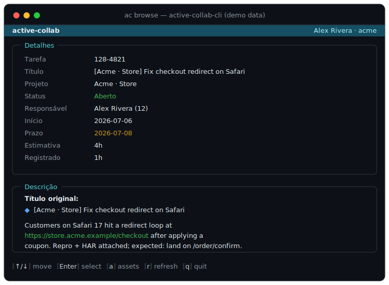

# active-collab-cli

**Unofficial** command-line tool and interactive terminal UI (TUI) for reading
and browsing [ActiveCollab](https://activecollab.com) tasks from self-hosted
instances. Supports multi-instance configuration, SQLite-backed token storage,
and outputs human-readable or JSON task views.

The application ships as a single self-contained binary (`ac`) built with Rust
(ratatui + crossterm + tokio). No interpreter or runtime is required on the target.

> ## ⚠️ Unofficial — not affiliated with ActiveCollab
>
> This is an independent, community-built project. It is **not** an official
> ActiveCollab product and is **not affiliated with, endorsed by, sponsored by,
> or supported by** ActiveCollab or A51 d.o.o. **"ActiveCollab" is a trademark of
> its respective owner** and is used here **only** to describe compatibility with
> the ActiveCollab REST API of your own self-hosted instance. This tool stores no
> credentials beyond a local API token, sends that token only to your configured
> host, and is provided "as is", without warranty. Use at your own risk.

---

## Screenshot



*Interactive TUI — the task-detail view (project, status, description, assets).
The data shown is fictional; no real instance or client data is depicted.*

---

## Install

### macOS / Linux (curl one-liner)

```sh
curl -fsSL https://raw.githubusercontent.com/ejklock/active-collab-cli/main/install.sh | sh
```

The script downloads the pre-built `active-collab` binary for your platform from
the latest GitHub Release and places it on your PATH.

### Windows (PowerShell one-liner)

```powershell
irm https://raw.githubusercontent.com/ejklock/active-collab-cli/main/install.ps1 | iex
```

### Manual download

Download the pre-built binary for your platform from the
[Releases page](https://github.com/ejklock/active-collab-cli/releases), place it on your
PATH, and make it executable (`chmod +x active-collab` on Unix).

| Platform | Asset |
|---|---|
| Linux x86\_64 | `active-collab-linux-x86_64` |
| macOS x86\_64 (Intel) | `active-collab-macos-x86_64` |
| macOS arm64 (Apple Silicon) | `active-collab-macos-arm64` |
| Windows x86\_64 | `active-collab-windows-x86_64.exe` |

### Build from source (Docker required)

No local Rust toolchain needed. The crate is at the repo root; Docker provides
the build environment.

```sh
# Development build
docker compose run --rm dev cargo build

# Release binary (placed in target/release/ac)
docker compose build
docker compose run --rm build
```

---

## Usage

### Setup — manage instances

```sh
# Register an ActiveCollab instance (interactive wizard prompts for missing fields)
ac setup add
ac setup add --name collab --url https://collab.example.com --email me@example.com
# Password is always entered hidden via a prompt — never passed as a flag.

# List configured instances (tokens never shown)
ac setup list

# Remove an instance and its cached tasks
ac setup remove --name collab

# Test connectivity to all (or one) configured instance
ac setup test
ac setup test --name collab

# Show the current display language
ac setup language

# Set the display language (persists to SQLite; survives across invocations)
ac setup language en
ac setup language pt_BR
```

### get — fetch a task by URL or short form

```sh
ac get 665/75159
ac get https://collab.example.com/projects/665/tasks/75159
```

### current — fetch the task from the current git branch

Branch must match `(feature|hotfix|fix)/PROJECT_ID-TASK_ID` (e.g. `feature/665-75159`).

```sh
ac current
```

### mine — list open tasks assigned to you

```sh
ac mine
ac list          # alias
```

When run in a terminal (TTY), `mine` opens an interactive arrow-key list of your
open tasks aggregated across all configured instances. Select a task to view its
detail or open/download its assets. When output is piped or redirected (non-TTY),
`mine` falls back to a plain table suitable for scripts.

### browse — interactive TUI

Arrow-key terminal browser for your open tasks. Navigate projects → tasks →
task detail, then open/download the task's assets.

```sh
ac browse
ac browse --instance collab   # required when >1 instance configured
```

The TUI uses ratatui for layout and crossterm for input, giving consistent mouse
click, scroll, and keyboard behavior on Linux, macOS, and Windows. It shows a
loading indicator during fetches and guards against duplicate in-flight refresh
requests (single-flight).

The task detail view shows:

- **Meta table** — a two-column table listing Task, Project, Title, Status,
  Assignee, Start, Due, Estimate, and Logged.
- **Description** — the task body; falls back to `(no description)` when empty.
- **Artifacts panel** — lists each image / attachment / link as `[n] name` with
  its URL. Press `1`–`9` to open the matching artifact in your browser.
- **Comments** — one panel per comment (author · date as the panel title).

The detail view scrolls vertically when content exceeds the screen. The TUI
adapts to terminal resize events and guards against too-small terminals without
crashing. The footer shows key-cap style hints (`[key] action`).

Each task you open is written to the local SQLite `ticket_cache` keyed by instance
name; re-opening the same task is instant and offline-tolerant. Press `r` inside
the detail view to bypass the cache and re-fetch from the API.

**Key bindings**

| Screen | Keys |
|---|---|
| Projects / Tasks lists | `↑`/`↓` or `k`/`j` move · `Enter` select · `q` quit · `b` back · `s` settings |
| Task detail | `↑`/`↓` or `k`/`j` scroll · `PgUp`/`PgDn` page · `a` assets · `r` refresh · `1`–`9` open artifact · `q`/`b` back |
| Settings | `↑`/`↓` or `k`/`j` move · `Enter` select · `q`/`b` back |
| Assets | `↑`/`↓` or `k`/`j` move · `o` open in browser · `d` download · `q`/`b` back |

**Settings screen** — press `[s]` from any list screen to open the Settings panel.
It offers two pickers:

- **Language** — choose `en` (English) or `pt_BR` (Portuguese (Brazil)). The
  selection persists to SQLite and takes effect immediately without restarting.
- **Active instance** — choose which configured instance `browse` uses by default
  when you have more than one. The selection persists to SQLite.

- **Assets** — image, attachment, and link URLs extracted from the task body,
  comments, and attachments. `o` opens the URL in your browser; `d` downloads
  it. The `X-Angie-AuthApiToken` header is attached **only** when the asset
  URL's scheme and host match the configured instance — foreign hosts are
  fetched without credentials.

### Bare-invocation shortcuts

```sh
ac 665/75159     # same as: ac get 665/75159
ac               # same as: ac current (when branch matches)
```

### Flags

| Flag | Applies to | Effect |
|---|---|---|
| `--instance NAME` | `get`, `current`, `mine`, `browse` | Force a specific configured instance (required when >1 configured) |
| `--short` | `get`, `current` | Print `PROJECT/TASK<TAB>name` only |
| `--no-comments` | `get`, `current` | Omit the comments section |
| `--json` | `get`, `current` | Print raw task JSON (always hits the API, bypasses cache) |
| `--refresh` | `get`, `current` | Bypass the task cache and re-fetch from the API |

---

## Internationalization

The binary ships with English (default) and Brazilian Portuguese (`pt_BR`)
translations for all user-facing output. Translations are embedded at compile time
as JSON catalogs — no external files required at runtime.

**Durable setting** — persist your preferred language to SQLite:

```sh
ac setup language pt_BR   # set
ac setup language          # show current
```

**One-off override** — the `ACTIVE_COLLAB_LANG` environment variable overrides the
stored setting for a single invocation:

```sh
ACTIVE_COLLAB_LANG=pt_BR ac browse
```

**Resolution order:** `ACTIVE_COLLAB_LANG` env var → SQLite setting → `en`.

The language can also be changed interactively from inside `browse` — press `[s]`
to open Settings and select a language; the change takes effect immediately without
restarting.

---

## Configuration

**Database path:** `~/.config/active-collab/active-collab.db`

Override with the `ACTIVE_COLLAB_DB` environment variable:

```sh
ACTIVE_COLLAB_DB=/custom/path/active-collab.db ac get 665/75159
```

---

## Security

- The API token is stored only in the local SQLite database with directory
  permissions `0700` and file permissions `0600`.
- The token is transmitted exclusively via the `X-Angie-AuthApiToken` HTTP header —
  never in a URL, never printed, never passed as a process argument.
- The password is **never stored**. Only the token returned from the issue-token
  endpoint is persisted.
- The token is sent only to the configured instance's own host. Requests to asset
  URLs on other hosts carry no token.

---

## Exit codes

| Code | Meaning |
|---|---|
| 0 | Success |
| 1 | Task not found / HTTP error / parse error |
| 2 | Usage error, unknown instance, no instances configured, branch mismatch |

---

## Development

```sh
# Run all tests (unit + integration, including comment-policy gate)
docker compose run --rm dev cargo test

# Run only the comment-policy gate
docker compose run --rm dev cargo test --test comment_policy

# Lint
docker compose run --rm dev cargo clippy -- -D warnings

# Format check
docker compose run --rm dev cargo fmt --check
```

The TUI core (`src/app.rs` `update`) is a pure function with no terminal or
network dependency — it is unit-tested directly without a TTY.
