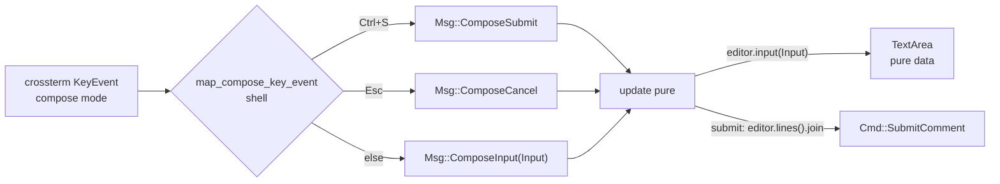

# 0064. The comment compose editor adopts `tui-textarea`

## Context

Comment compose is a mode on the Detail screen: a `Compose` value carried by the
`DetailOverlay::Compose` variant ([ADR 0034](/adr/0034-comment-compose-mode-multiline.md),
[ADR 0047](/adr/0047-detail-overlay-as-one-typed-state.md)), rendered in the reusable
modal ([ADR 0039](/adr/0039-reusable-modal-overlay-for-compose-and-confirm.md)). The
editing model in ADR 0034 is deliberately minimal:

```rust
struct Compose { kind: ComposeKind, buffer: String, status: ComposeStatus }
```

The buffer only grows/shrinks at the **end**: `Msg::ComposeInput(char)` appends,
`Msg::ComposeBackspace` pops, `Msg::ComposeNewline` inserts `\n`. ADR 0034 named the
gap in its own Consequences: *"the first version's editing is append/backspace + newline
at the end of the buffer — no in-body caret movement; richer caret editing is a deferred
follow-up (PRD 0002 open question)."* There is no left/right/up/down caret, no
home/end, no word delete, no selection, no undo/redo — table stakes for composing a
multi-paragraph comment.

Building that by hand means a caret index, wrapping-aware column math, a selection
model, and an undo stack — a text editor. The Rust/ratatui ecosystem already ships one:
**`tui-textarea`** (multi-line editor widget; undo/redo, selection, regex search,
backend-neutral input). The question this ADR settles is not *whether* to adopt it, but
**how to adopt it without breaking the pure TEA core** that ADR 0034 fought to preserve.

The tension: `tui-textarea` is stateful and consumes input events. The obvious wiring —
feed it raw `crossterm::KeyEvent`s — is exactly the "raw key passthrough" ADR 0034
rejected, because it drags terminal key semantics into the pure `update()` and dissolves
the `Msg` vocabulary that makes `update()` exhaustively testable.

## Decision

We will replace the `String` buffer with a **`tui_textarea::TextArea<'static>`** held in
`Compose`, and route compose-mode input through **one** message that carries
`tui-textarea`'s own **backend-neutral** `Input` — keeping the shell as the sole authority
on "which keys are text", exactly as ADR 0034 established.

### 1. The editor replaces the buffer

```rust
struct Compose {
    kind: ComposeKind,                 // New | Edit { comment_id } — unchanged
    editor: tui_textarea::TextArea<'static>,   // was: buffer: String
    status: ComposeStatus,             // Editing | Submitting | Error — unchanged
}
```

- **Open new** → `TextArea::default()`.
- **Open edit** (`ComposeKind::Edit`) → `TextArea::from(body.lines())` — pre-filled,
  caret placed by the editor.
- **Submit body** → `compose.editor.lines().join("\n")` (feeds the existing
  `Cmd::SubmitComment { …, body }`; the write seam is untouched).

`ComposeKind` and `ComposeStatus` are unchanged; the New/Edit/Submitting/Error lifecycle
and the async write path ([ADR 0035](/adr/0035-server-truth-refresh-after-comment-mutation.md),
[ADR 0054](/adr/0054-comment-write-outcome-typed-classification.md)) are unchanged.

### 2. The shell still decides "which keys are text" (preserves ADR 0034)

The shell's `map_compose_key_event` keeps its two reserved chords and collapses the rest
into a single input message:

- `Ctrl+S` → `Msg::ComposeSubmit` (**intercepted before the editor** — never reaches it)
- `Esc` → `Msg::ComposeCancel` (**intercepted before the editor**)
- every other key → `Msg::ComposeInput(tui_textarea::Input)`, where the shell converts the
  `crossterm::KeyEvent` into `tui-textarea`'s backend-neutral `Input` (`Input::from(key)`).



The granular `ComposeNewline` / `ComposeBackspace` / `ComposeInput(char)` messages are
**folded into** `ComposeInput(Input)` — Enter, Backspace, printable chars, arrows,
Home/End, word delete, and undo/redo all arrive as `Input` and are applied uniformly.

### 3. `update()` stays pure

```rust
Msg::ComposeInput(input) => {
    if let DetailOverlay::Compose(c) = overlay { c.editor.input(input); }
}
```

`TextArea::input` mutates an in-memory data structure and touches **no terminal and no
async** — it is pure in the sense the TEA core requires (`update(Model, Msg) -> (Model,
Vec<Cmd>)` with no I/O). The core's dependency is on the **`tui-textarea` crate's types**
(`TextArea`, `Input`), *not* on `crossterm` — the backend-neutral `Input` is the seam that
keeps terminal specifics in the shell.

### 4. Rendering: the editor draws itself inside the modal (extends ADR 0039)

`render_modal` still paints the dimmed backdrop, `Clear`s the box, and draws the border +
title + in-box hint/status. For compose, instead of feeding static body lines, `view()`
renders the **`TextArea` widget into the modal's inner content `Rect`** (`render_modal`
exposes that inner area). The caret, the current-line highlight, selection, and vertical
scrolling within the box therefore come from `tui-textarea` — not from re-implemented
column math. The in-box hint (`Ctrl+S enviar · Esc cancelar`) and the transient status
(`Enviando…` / localized error) are unchanged.

### Guard / fitness function

- **Pure editing (unit, headless):** driving a sequence of `Msg::ComposeInput(Input)` —
  chars, `Enter`, caret moves, `Backspace`, undo/redo — through `update()` yields the
  expected `compose.editor.lines()`; `ComposeSubmit` emits `Cmd::SubmitComment` whose body
  equals `editor.lines().join("\n")`. No terminal, no async.
- **Shell key authority (unit):** `map_compose_key_event` maps `Ctrl+S -> ComposeSubmit`
  and `Esc -> ComposeCancel` (these never reach the editor), and every other compose-mode
  key -> `ComposeInput(Input)`; `map_browse_key_event` is unchanged; `'c'` still opens
  compose only on Detail.
- **Draft survives failure:** a `CommentMutationErr` test asserts `editor.lines()` are
  intact and `status = Error(_)` (no lost draft) — the ADR 0034 invariant, retargeted to
  the editor.
- **Edit pre-fill:** `ComposeOpen(Edit{id})` seeds the editor from the comment body
  (`editor.lines()` equals the body split on `\n`).
- **Render (`TestBackend`):** an open compose modal renders the editor content inside the
  centered box over the dimmed backdrop; the in-box hint/status appear.
- Full suite green; `clippy --all-targets -D warnings`, `fmt`, `comment_policy` clean;
  complexity within budget; mutation floor (Reviewer backstop) on the changed routing and
  submit-body derivation.

## Alternatives considered

- **Keep the hand-rolled `String` buffer and add caret math ourselves.** Rejected:
  re-implements a text editor (caret index, wrap-aware columns, selection, undo) that
  `tui-textarea` already provides and tests — cost with no upside, and a standing bug
  surface.
- **Feed raw `crossterm::KeyEvent`s into the editor via `Msg::ComposeKey(KeyEvent)`.**
  Rejected for the same reason ADR 0034 rejected raw passthrough: it drags crossterm key
  semantics into the pure core. Routing through `tui-textarea`'s **backend-neutral**
  `Input` keeps the core free of terminal types while still collapsing the message to one
  variant.
- **Hold the `TextArea` in the shell/view layer, outside the Model.** Rejected: it splits
  the compose state across two homes (the Model's `kind`/`status` and the shell's editor),
  breaks single-source-of-truth, and makes the compose lifecycle no longer unit-testable
  through `update()`. The editor is model state; only the *key-to-Input* decision is a
  shell concern.
- **Keep the granular `ComposeNewline`/`ComposeBackspace`/`ComposeInput(char)` vocabulary
  and translate each to a `TextArea` op.** Rejected: it enumerates a fraction of what a
  real editor accepts (no caret moves, no selection, no undo) and would need a new `Msg`
  per capability. One `ComposeInput(Input)` covers the whole editor surface; testability is
  retained because `Input` values are trivially constructed in a headless test.

## Consequences

**Easier / gained:**
- Comment compose gains caret movement, selection, word operations, and undo/redo with no
  hand-written column/selection/undo code — closing the ADR 0034 / PRD 0002 deferred gap.
- The pure/shell boundary is preserved: the shell owns "which keys are text", `update()`
  stays a pure state machine, and the compose lifecycle remains unit-testable.
- The `Msg` vocabulary shrinks (three compose-editing messages become one), and the modal
  render delegates caret/selection/scroll to the widget instead of re-deriving them.

**Harder / accepted trade-offs:**
- The pure core takes a **data dependency on the `tui-textarea` crate** (for the `TextArea`
  and `Input` types). This is a UI-crate name in the core module graph — mitigated by the
  fact that both are pure data types (no terminal, no async) and the dependency does not
  reach `crossterm`.
- `ComposeInput(Input)` is **coarser** than the named-intent messages it replaces: a test
  reads the resulting `editor.lines()` rather than asserting a specific buffer mutation.
  Accepted — the observable contract (resulting text, submitted body) is what matters, and
  it stays fully assertable.
- ADR 0034's editing/buffer representation is **amended** (the `buffer: String` +
  append/backspace model is replaced); ADR 0034's structural decision — *compose is a mode
  carried on `Screen::Detail`, and the shell maps keys by mode* — remains in force
  (refined into `DetailOverlay` by ADR 0047).

**Follow-ups:**
- Issue: adopt `tui-textarea` in `Compose` + the shell/`update`/render changes.
- A future ADR may enable `tui-textarea`'s regex `search` inside a long draft if a need
  appears (YAGNI for now).

## Verification

**Implementation impact:** `src/tui/model.rs` (`Compose` field; `reflow`/modal body wiring),
`src/tui/mod.rs` + `src/tui/events.rs` (`map_compose_key_event`, `Msg::ComposeInput(Input)`,
folded messages, `update` arm), `src/tui/view.rs` (render the `TextArea` into the modal
inner Rect), `src/tui/widgets/modal.rs` (expose the inner content Rect), `Cargo.toml`
(`tui-textarea`), `tests/unit/model.rs` + `tests/unit/tui_render.rs`.

**Verification criteria:**
- Driving chars + Enter + caret moves + Backspace + undo/redo through `update()` produces
  the expected `compose.editor.lines()`, and `ComposeSubmit` emits `Cmd::SubmitComment`
  with `body == editor.lines().join("\n")` (fitness function: `tests/unit/model.rs`).
- `Ctrl+S`/`Esc` never reach the editor (they map to `ComposeSubmit`/`ComposeCancel`);
  all other compose keys map to `ComposeInput(Input)` (fitness function:
  `map_compose_key_event` unit test).
- A `CommentMutationErr` leaves `editor.lines()` intact with `status = Error(_)`.

## Related

- ADR: [/adr/0034-comment-compose-mode-multiline.md](/adr/0034-comment-compose-mode-multiline.md) (compose as a Detail mode; the editing/buffer model this amends)
- ADR: [/adr/0047-detail-overlay-as-one-typed-state.md](/adr/0047-detail-overlay-as-one-typed-state.md) (`DetailOverlay::Compose` carries `Compose`)
- ADR: [/adr/0039-reusable-modal-overlay-for-compose-and-confirm.md](/adr/0039-reusable-modal-overlay-for-compose-and-confirm.md) (the modal the editor renders inside; extended to expose the inner Rect)
- ADR: [/adr/0035-server-truth-refresh-after-comment-mutation.md](/adr/0035-server-truth-refresh-after-comment-mutation.md), [/adr/0054-comment-write-outcome-typed-classification.md](/adr/0054-comment-write-outcome-typed-classification.md) (the unchanged write path)
- ADR: [/adr/0007-tui-module-structure.md](/adr/0007-tui-module-structure.md), [/adr/0008-async-event-loop-with-eventstream-and-select.md](/adr/0008-async-event-loop-with-eventstream-and-select.md) (the pure TEA core)
- PRD: [/prd/0002-task-comment-authoring.md](/prd/0002-task-comment-authoring.md) (the deferred "richer caret editing" question)
- Issue: [/issues/0057-comment-compose-tui-textarea.md](/issues/0057-comment-compose-tui-textarea.md)
</content>
</invoke>
