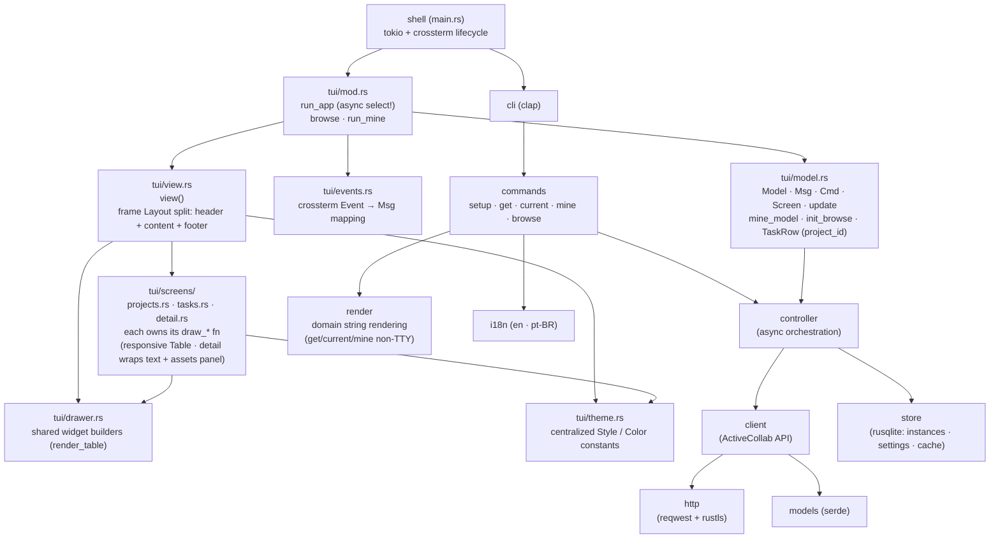
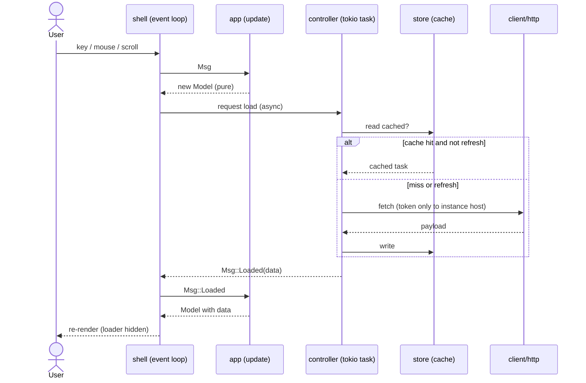

# Architecture

Living diagrams of the Rust app ([ADR 0002](/adr/0002-rewrite-in-rust-with-ratatui.md),
[ADR 0006](/adr/0006-promote-crate-to-repo-root.md),
[ADR 0007](/adr/0007-tui-module-structure.md)).
Node names use [context-index](/context/index.md) vocabulary. All slices R0–R8 are
complete; the crate is at the repo root (`src/`). This view is updated as each
structural change lands (maintenance invariant: structural change updates this diagram).

## Module structure

**Boundaries / fitness:**

- **tui/model.update** is pure — no terminal, no async, no I/O. Gate-checked by unit
  tests (BDR 0001) and `cargo test` running headless.
- **client/http** is the only outbound-network boundary; **token host isolation**
  is enforced here and gate-checked by a negative test (PRD NFR).
- **store** owns all persistence; no other module opens the SQLite file.
- **mine and browse share one TEA core**: `run_app` (async) seeds from `mine_model`
  (rows already fetched, no init_cmds) or `init_browse` (LoadTasksByProject on start).
  Enter/click on the mine Tasks screen opens Detail through the same `update` path.
- **the view layer is responsive and theme-centralized**: `view()` splits the frame
  vertically into three regions — a one-line identity header (`app_header_style`:
  white on cyan, bold), a variable-height content area, and a one-line footer.  The
  too-small guard (width < 24 or height < 6) bypasses all three and renders only a
  centered `"Terminal too small"` message.  List screens render a ratatui `Table`
  driven by width `Constraint`s (no fixed-width truncation) with a
  `TableState`-driven selection highlight; the detail screen wraps long lines and
  renders assets in a dedicated panel. All colors live in `theme.rs` — no inline
  `Color`/`Style` literals in the screen or drawer modules.

## Read / browse data flow

The refresh path is **single-flight**: a refresh requested while a load is in
flight is dropped, not queued.

Background results (e.g. `Msg::LoadedTasksByProject`) are delivered over a
`tokio::sync::mpsc` channel that is a first-class arm of the `tokio::select!`
loop. The model is updated and the screen repainted as soon as the result
arrives — no input event is required.

## Quality gates

The Rust crate enforces a comment policy via the `comment_policy` integration test (`tests/comment_policy.rs`), run as part of `cargo test`. It forbids banner/divider comments (e.g. `// ----`, `// === Section ===`, box-drawing chars) and commented-out Rust code, while allowing doc comments (`///`, `//!`) and ordinary prose why-comments that explain non-obvious intent.
