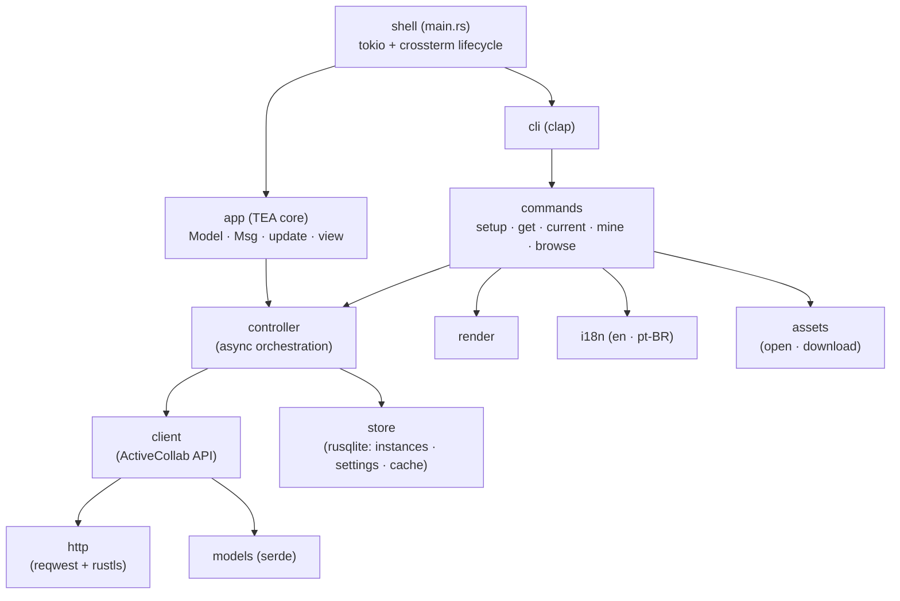
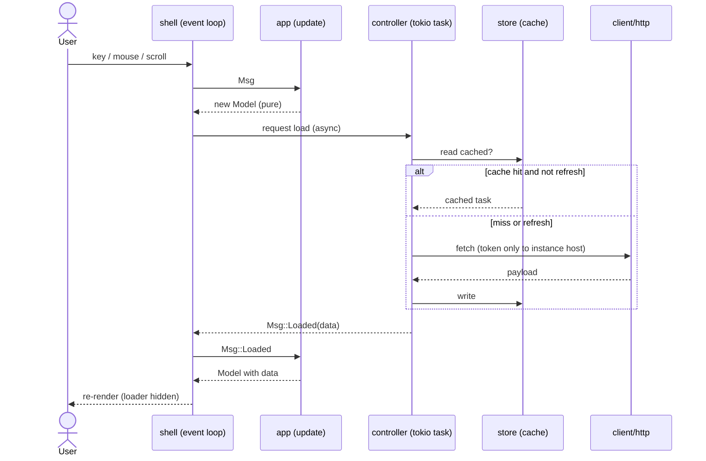

# Architecture

Living diagrams of the Rust app ([ADR 0002](/adr/0002-rewrite-in-rust-with-ratatui.md),
[ADR 0006](/adr/0006-promote-crate-to-repo-root.md)).
Node names use [context-index](/context/index.md) vocabulary. All slices R0–R8 are
complete; the crate is at the repo root (`src/`). This view is updated as each
structural change lands (maintenance invariant: structural change updates this diagram).

## Module structure

**Boundaries / fitness:**

- **app.update** is pure — no terminal, no async, no I/O. Gate-checked by unit
  tests (BDR 0001) and `cargo test` running headless.
- **client/http** is the only outbound-network boundary; **token host isolation**
  is enforced here and gate-checked by a negative test (PRD NFR).
- **store** owns all persistence; no other module opens the SQLite file.

## Read / browse data flow

The refresh path is **single-flight**: a refresh requested while a load is in
flight is dropped, not queued.

## Quality gates

The Rust crate enforces a comment policy via the `comment_policy` integration test (`tests/comment_policy.rs`), run as part of `cargo test`. It forbids banner/divider comments (e.g. `// ----`, `// === Section ===`, box-drawing chars) and commented-out Rust code, while allowing doc comments (`///`, `//!`) and ordinary prose why-comments that explain non-obvious intent.
