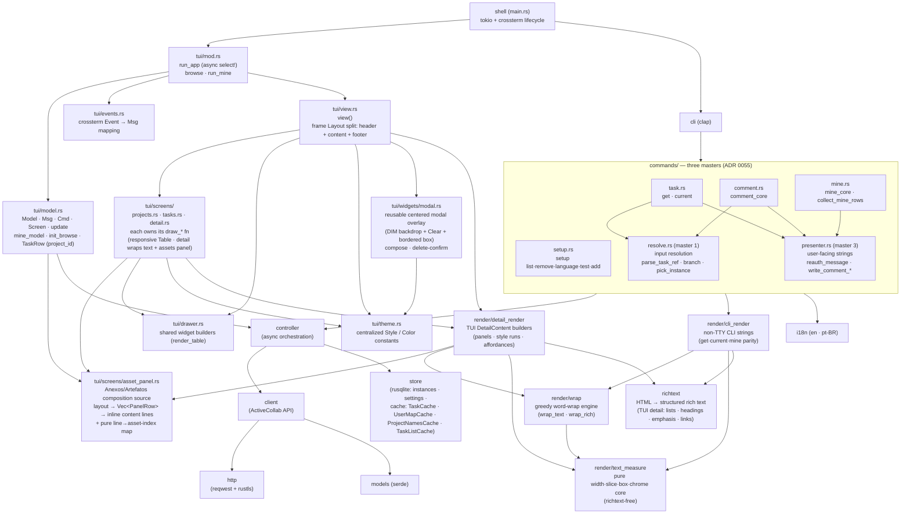
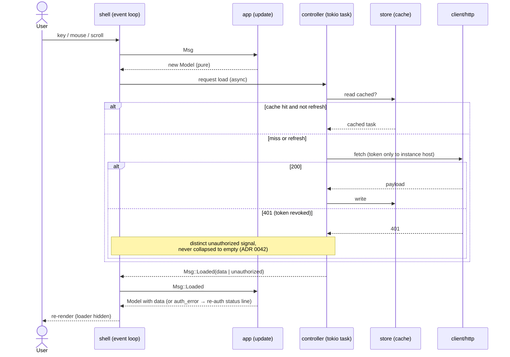
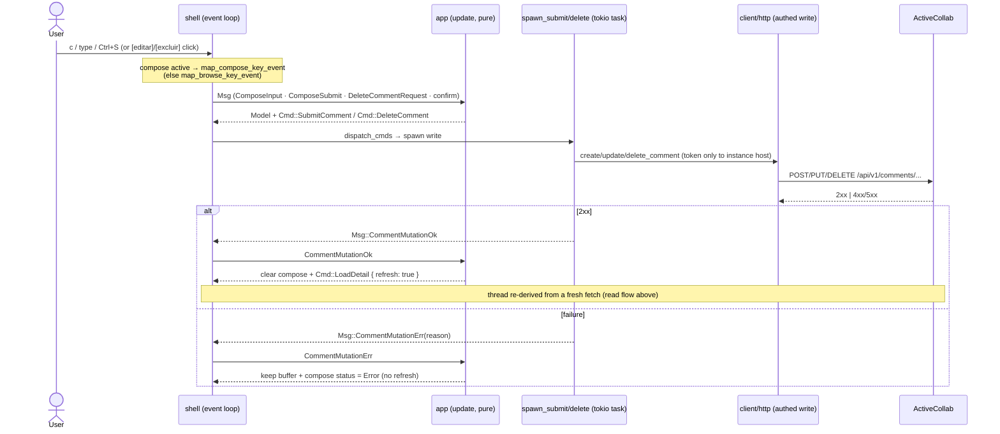

# Architecture

Living diagrams of the Rust app ([ADR 0002](/adr/0002-rewrite-in-rust-with-ratatui.md),
[ADR 0006](/adr/0006-promote-crate-to-repo-root.md),
[ADR 0007](/adr/0007-tui-module-structure.md)).
Node names use [context-index](/context/index.md) vocabulary. All slices R0–R8 are
complete; the crate is at the repo root (`src/`). This view is updated as each
structural change lands (maintenance invariant: structural change updates this diagram).

## Module structure

**Boundaries / fitness:**

- **render is a layered stack, not a god-module** ([ADR 0049](/adr/0049-split-render-into-text-measure-wrap-and-render-adapters.md)):
  a pure, `richtext`-free `render/text_measure` core (display-width / slice / box-unwrap
  primitives + chrome constants + box-drawing chars) sits at the bottom; `render/wrap` (the
  ADR 0048 greedy word-wrap engine) depends on it; and two output adapters sit on top —
  `render/cli_render` (the non-TTY `get`/`current`/`mine` parity strings) and
  `render/detail_render` (the TUI `DetailContent` builders + affordance registry). The two
  adapters never depend on each other; `render/mod.rs` is a thin root holding only the shared
  low-level helpers/types both use, plus the re-export surface. Fitness: `text_measure` imports
  no `richtext`; `cli_render`/`detail_render` do not reference each other; the split is
  behavior-preserving (the whole `cargo test` suite is green on the combined tree).
- **commands is a directory of deep modules, not a flat god-file** ([ADR 0055](/adr/0055-commands-split-three-masters.md)):
  the 1035-line `commands.rs` splits into `src/commands/` where each command core served three
  masters at once — input resolution, orchestration, presentation. Now `resolve.rs` (master 1)
  owns input resolution (`parse_task_ref`/`parse_branch_ref`/`pick_instance`/`resolve_task_ref_for_comment`),
  `presenter.rs` (master 3) owns the user-facing strings and single-homes the [ADR 0042](/adr/0042-detect-401-and-guide-reauthentication.md)
  re-auth message in one `reauth_message()`, and one orchestration module per family
  (`setup.rs`/`task.rs`/`comment.rs`/`mine.rs`) wires the two. `mod.rs` is a thin root: only
  `mod` declarations, the `pub(crate) use` re-export surface, and the `#[path]` test include.
  Fitness: `resolve.rs` imports no client/cache; `presenter.rs` imports only `i18n`/`agent_json`/`Write`;
  the family modules may depend on the masters (`task`/`comment` on both, `mine` on `presenter`;
  `setup` presents inline and depends on neither), never the reverse; the re-auth literal appears once
  within `src/commands/`; `main.rs` and `tui/mod.rs` are untouched (the seam holds via re-exports);
  behavior-preserving (full `cargo test` green under `--test-threads=1`).
- **tui/model.update** is pure — no terminal, no async, no I/O. Gate-checked by unit
  tests (BDR 0001) and `cargo test` running headless.
- **client/http** is the only outbound-network boundary; **token host isolation**
  is enforced here and gate-checked by a negative test (PRD NFR).
- **store** owns all persistence; no other module opens the SQLite file.
- **mine and browse share one TEA core**: `run_app` (async) seeds from `mine_model`
  (rows already fetched, no init_cmds) or `init_browse` (LoadTasksByProject on start).
  Enter/click on the mine Tasks screen opens Detail through the same `update` path.
- **the view layer is responsive and theme-centralized**: `view()` splits the frame
  vertically into three regions — a one-line identity header (`app_header_style`:
  white on cyan, bold), a variable-height content area, and a footer.  The footer
  itself is **two stacked regions** ([ADR 0038](/adr/0038-detail-footer-contextual-hint-and-status-line.md)):
  a **contextual instruction line** whose Detail-screen text changes by mode
  (browsing / composing / confirming-delete / own-comment-focused, via `detail_hint`),
  and a **thin status line** that surfaces one derived transient
  string (`Enviando…`, a write error, `Copiado ✓`) and is blank — collapsing the row —
  when idle.  The whole footer decision — hint selection (with the modal one-home
  suppression), the transient status, and the `FooterPlan` layout — is single-homed in a
  pure `src/tui/footer.rs` behind one `footer::plan(screen, …)`
  ([ADR 0053](/adr/0053-footer-decision-as-pure-module.md)); `view()` is a draw-only
  adapter over it (mirroring the pure `detail_geometry`/`task_layout` split).
  The too-small guard (width < 24 or height < 6) bypasses all three and
  renders only a centered `"Terminal too small"` message.  List screens render a
  ratatui `Table` driven by width `Constraint`s (no fixed-width truncation) with a
  `TableState`-driven selection highlight; the detail screen wraps long lines and
  renders the assets inline at the end of the single globally-scrollable content
  (ADR 0029 — no fixed panel). All colors live in `theme.rs` — no inline
  `Color`/`Style` literals in the screen or drawer modules.
- **the detail thread has a keyboard focus cursor over the comment cards**
  ([ADR 0037](/adr/0037-comment-card-keyboard-focus.md)): `Screen::Detail` carries a
  `focused_comment: Option<usize>` and a memoized `comment_spans` line-range cache
  (built by `reflow_detail` alongside the line cache, mirroring the Tasks card-layout
  cache of [ADR 0031](/adr/0031-tasks-card-layout-cache.md)).  `j`/`k` (and `Up`/`Down`)
  move the focus, which highlights the focused card and derives a scroll `offset` that
  brings it fully into view (reusing the `first_visible_card` discipline); `PageUp`/
  `PageDown` and the wheel keep scrolling raw lines without moving focus.  Edit/delete
  stay on the existing Ctrl/Cmd+click affordances ([ADR 0036](/adr/0036-permission-aware-comment-targeting.md)).
- **transient comment interactions render as a centered modal overlay, not inline in the
  scroll** ([ADR 0039](/adr/0039-reusable-modal-overlay-for-compose-and-confirm.md)):
  `tui/widgets/modal.rs` owns a reusable primitive — a pure `modal_area(frame, w, h)`
  (centered + clamped `Rect`) plus a `render_modal` helper that dims the backdrop
  (`Modifier::DIM` over the content cells), `Clear`s the modal `Rect`, and draws a
  bordered box with title + body + an in-box hint/status.  Both the **comment compose**
  (`overlay.is_compose()`, title `Novo`/`Editar comentário`, the buffer + `Ctrl+S`/`Esc`
  hint + `Enviando…`/error status) and the **delete-confirm** (`overlay.is_confirm()`,
  `[confirmar]`/`[cancelar]` buttons, also Enter/Esc) draw through it — so `reflow_detail`
  no longer appends the compose lines and `build_detail_content` no longer renders the
  inline confirm tokens.  While a modal is open it owns the hint/status; the footer does
  not duplicate them (amends [ADR 0038](/adr/0038-detail-footer-contextual-hint-and-status-line.md)).
- **the Anexos/Artefatos assets are part of the global scroll, from one composition
  source** ([ADR 0029](/adr/0029-assets-inline-in-scrollable-detail-content.md),
  amending [ADR 0028](/adr/0028-asset-panel-single-layout-source.md)):
  `screens/asset_panel.rs` owns a pure `layout(assets, width) -> Vec<PanelRow>`;
  `build_detail_content` (`render.rs`) splices that vector into the scrollable
  `lines`/`line_styles` (so every attachment is reachable by scrolling — no fixed
  panel, no height cap). The asset click is **scroll-aware**, sharing
  the body-link `offset + (row − text_top)` translation
  ([ADR 0020](/adr/0020-body-links-inline-url-native-click.md)). Fitness: the
  rendered asset lines and the click hit-target both derive from the one `layout`
  vector (they cannot drift), gate-checked by a unit test on the `Vec<PanelRow>` and
  a TestBackend render derived from the real buffer
  ([BDR 0022](/bdr/0022-assets-inline-scrollable-detail-content.md)).
- **every detail click hit-target is emitted structurally into one affordance
  registry** ([ADR 0043](/adr/0043-detail-hit-targets-emitted-structurally.md),
  extending [ADR 0028](/adr/0028-asset-panel-single-layout-source.md)/[0032](/adr/0032-asset-row-link-style-structural.md)
  from style to hit-target): `build_detail_content` emits `DetailContent.affordances`
  — typed `LocalAffordance { line_idx, col_start, col_end, kind }` spans for comment
  `Edit`/`Delete`, body-link `OpenUrl(url)`, and asset `OpenAsset(url)` (one span per
  wrapped fragment, the openable target resolved once at emit time). Click resolution is
  one deep, pure `src/tui/hit_test.rs` module ([ADR 0044](/adr/0044-detail-click-resolution-as-hit-test-module.md)):
  `resolve_detail_click` maps a click to a typed `DetailClickTarget` via a single
  viewport→`line_idx` translation and one positional lookup over that list; the model maps
  the target to the TEA effect. Every affordance activates on **Ctrl/Cmd+click** (comment
  Edit/Delete, body `OpenUrl`, asset `OpenAsset`); a **plain** click is reserved for text
  selection ([BDR 0014](/bdr/0014-body-link-inline-url-activation.md) Sc.8). The old
  click-time re-derivation — `resolve_wrapped_url` + the inverse-wrap helpers, and the asset
  `section_lines` re-call — is **deleted** (retiring the obs-35 latent over-join bug), and
  the five scattered click functions collapse into the one `hit_test` module. Style and
  hit-target now share one single-source discipline. The viewport↔content row mapping that
  `hit_test` (and the V6 selection/copy paths `is_in_body_area` / `extract_selected_text`)
  rely on lives once in a pure `src/tui/detail_geometry.rs`
  ([ADR 0045](/adr/0045-detail-viewport-geometry-module.md)): `DETAIL_TEXT_TOP`,
  `content_height`, `is_in_content`, and `row_to_line_idx` — so hit-test, selection, and copy
  cannot drift on which content line a terminal row maps to.

## Read / browse data flow

The refresh path is **single-flight**: a refresh requested while a load is in
flight is dropped, not queued.

The **browse/mine list load** is **stale-while-revalidate** for the project
directory ([ADR 0014](/adr/0014-browse-list-project-name-cache-swr.md),
[BDR 0008](/bdr/0008-browse-list-refresh-cached-directory.md)): per instance,
`controller::tasks_by_project` **always** fetches the open tasks but serves
project **names** from the per-instance `ProjectNamesCache` (TTL), issuing
`list_projects` only on a cache miss or a stale entry. A warm refresh therefore
hits the network for open tasks alone — the directory fetch is the cached, slow
call. Fitness: a warm refresh issues **zero** `list_projects` requests
(gate-checked against the mocked server).

The **detail load** enriches the task with its **project name** before rendering
([ADR 0022](/adr/0022-detail-title-as-meta-row.md),
[BDR 0016](/bdr/0016-detail-title-row-project-name.md)): the task JSON carries only
`project_id`, so the load path resolves the name from the **same** per-instance
`ProjectNamesCache` the browse/mine list uses and injects `project_name`, which the
`Detalhes` panel renders in the `Projeto` row (with a fallback on a cache miss). No new
network call — the name comes from the existing cache.

Background results (e.g. `Msg::LoadedTasksByProject`) are delivered over a
`tokio::sync::mpsc` channel that is a first-class arm of the `tokio::select!`
loop. The model is updated and the screen repainted as soon as the result
arrives — no input event is required.

## Write / comment-mutation data flow

The app's first **write** path ([PRD 0002](/prd/0002-task-comment-authoring.md))
creates/edits/deletes a comment on the open task. It reuses the same TEA effect
machinery as reads: a pure `update()` emits a write `Cmd`, the shell spawns it as a
background task, and the 2xx result feeds a **server-truth refresh**
([ADR 0035](/adr/0035-server-truth-refresh-after-comment-mutation.md)) rather than an
optimistic local edit.

**Write boundaries / fitness:**

- **`client/http` stays the only outbound-network boundary**, and **token
  host-isolation extends to writes**: `authed_post`/`authed_put`/`authed_delete` attach
  `X-Angie-AuthApiToken` only via the same `host_gated_token_header` gate as
  `authed_get` ([ADR 0033](/adr/0033-authenticated-write-seam-comment-client.md)).
  Gate-checked by a negative test (no token off-host).
- **`tui/model.update` stays pure** through the write path: it owns the Detail overlay state
  as one typed `Screen::Detail.overlay: DetailOverlay { None, Compose(Compose), ConfirmDelete }`
  — compose and delete-confirm are mutually exclusive by construction
  ([ADR 0047](/adr/0047-detail-overlay-as-one-typed-state.md)) — and emits write `Cmd`s, but
  never performs I/O. The shell owns the mode-aware key mapping (which keys are *text*) and the
  spawned write ([ADR 0034](/adr/0034-comment-compose-mode-multiline.md)).
- **No optimistic mutation:** the mutation arms construct no synthetic comment; the
  thread is always re-derived from the server after a 2xx
  ([ADR 0035](/adr/0035-server-truth-refresh-after-comment-mutation.md)). Gate-checked by
  a unit test asserting `CommentMutationOk` emits exactly one `LoadDetail { refresh:true }`.
- **Edit/delete target a comment** via permission-aware `[editar]`/`[excluir]` click
  targets rendered only on the user's own comments (`created_by_id == instance.user_id`),
  reusing the scroll-aware asset click-map
  ([ADR 0036](/adr/0036-permission-aware-comment-targeting.md)). The local own-check is an
  affordance filter; the **server** (`canEdit`/`canDelete`) is the authorization boundary.
- **A non-interactive `comment` command writes through the same seam, no TEA loop**
  ([ADR 0040](/adr/0040-non-interactive-comment-write-command.md)): `dispatch_comment`
  (`main.rs`) → `comment_core` (`commands.rs`) resolves the task (`parse_task_ref` or the
  current git branch, as `current` does), reads the body from `-m/--message` or **stdin**,
  and calls the **same** `client.create_comment` the TUI uses — attributed to the logged-in
  user (the host-gated instance token owner; a configured instance is required). It is a
  one-shot synchronous write (not `update()`/`Cmd`): success prints a human line or, with
  `--json`, a curated minified `{"ok":true,"comment_id":N,"task_id":N,"project_id":N}`
  (`agent_json::comment_result`, extending the read `--json` contract of
  [ADR 0011](/adr/0011-agent-json-output-contract.md) to a write); an empty body exits `2`,
  and no task / no instance / an HTTP error exits non-zero with no false success. Deleting
  the command leaves the TUI write intact — it is a non-interactive adapter over the one
  write seam, not a second implementation.

## Auth-failure (401) handling

ActiveCollab's API token is **durable** — there is no refresh-token endpoint; it is
valid until revoked (logout, password change, admin removal)
([ADR 0042](/adr/0042-detect-401-and-guide-reauthentication.md)). A revoked token makes
every authenticated request return **HTTP 401**, which is detected as a **distinct
condition and never collapsed into empty data**:

- **Status-returning methods** (`fetch_task`, `create/update/delete_comment`) expose the
  status; callers branch on `HTTP_UNAUTHORIZED` (a shared `401` constant).
- **Collapsing methods** (`fetch_open_tasks`) raise a typed **`Unauthorized`** error on
  401 (other non-200 stays the empty default); existing `.unwrap_or_default()` callers
  swallow it unchanged, so the change is non-breaking.

Each surface translates the 401 into one shared, actionable re-auth message
(`i18n::t(...)`, pt-BR in `locales/pt_BR.json`): the **CLI** (`get`/`current`/`mine`/
`comment`) prints it and **exits non-zero**; the **TUI** sets a `Screen::Detail.auth_error`
flag rendered in the **thin status line** ([ADR 0038](/adr/0038-detail-footer-contextual-hint-and-status-line.md)),
pointing the user to `ac setup add`. Recovery is **re-authentication** (re-running the
idempotent `setup add`), not a token refresh; there is no in-app re-auth modal.

## Quality gates

The Rust crate enforces a comment policy via the `comment_policy` integration test (`tests/comment_policy.rs`), run as part of `cargo test`. It forbids banner/divider comments (e.g. `// ----`, `// === Section ===`, box-drawing chars) and commented-out Rust code, while allowing doc comments (`///`, `//!`) and ordinary prose why-comments that explain non-obvious intent.
