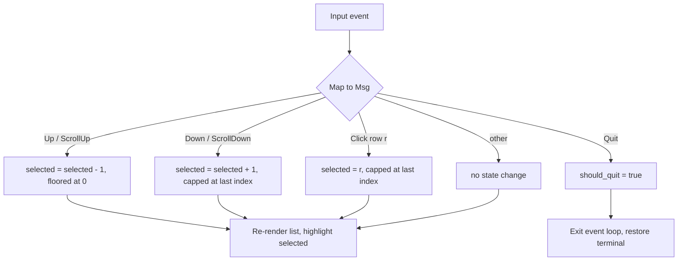

# 0001. Task list navigation: mouse, scroll, and bounded selection

<!-- Status lives in frontmatter. Observable behavior delivered by slice R0. -->

## Context

The motivating defect of the whole rewrite was that, in the old curses TUI, a
mouse click — or scrolling past the end of the list — quit the entire app
(a misparsed escape sequence mapped to "back", which popped the root screen).
This BDR pins the corrected, observable behavior of the task list so that
regression class cannot return. It is delivered by slice R0
([Issue 0001](/issues/0001-r0-spike-scaffold-docker-tui.md)) under
[PRD 0001](/prd/0001-rust-tui-cli-parity.md) and
[ADR 0002](/adr/0002-rewrite-in-rust-with-ratatui.md).

## Behavior

## Textual Description

The task list holds zero or more tasks and a current selection index. The pure
`update` function maps each input message to a new state:

- **Up / ScrollUp** moves the selection one row toward the top, never below the
  first row (index 0).
- **Down / ScrollDown** moves the selection one row toward the bottom, never past
  the last row.
- **Click(row)** sets the selection to the clicked row, clamped to the last row if
  the click lands beyond the list.
- **Quit** is the *only* message that requests application exit.
- On an **empty list**, every navigation/click message is a no-op and never
  panics.

No input other than Quit ever exits the application. Rendering highlights the
selected row inside a bordered list.

## Scenarios

**Scenario 1: move down within bounds**
- Given a list of 5 tasks with the first row selected
- When the user presses Down
- Then the second row is selected and the app stays open

**Scenario 2: down at the last row clamps**
- Given the last row is selected
- When the user presses Down or scrolls down
- Then the selection stays on the last row and the app stays open

**Scenario 3: up at the first row clamps**
- Given the first row (index 0) is selected
- When the user presses Up or scrolls up
- Then the selection stays at index 0 and the app stays open

**Scenario 4: click selects the clicked row**
- Given a list of tasks
- When the user clicks the row at position r
- Then row r becomes selected (clamped to the last row if r is beyond the list)
  and the app stays open

**Scenario 5: over-scroll never exits**
- Given any selection
- When the user sends Up/Down/ScrollUp/ScrollDown/Click repeatedly past the edges
- Then the application never requests exit (should_quit stays false)

**Scenario 6: quit exits**
- Given the app is running
- When the user sends Quit
- Then the application requests exit (should_quit becomes true)

**Scenario 7: empty list is safe**
- Given an empty task list
- When the user sends any navigation or click message
- Then nothing changes and the app does not panic

## Test Design

How this behavior is tested (single home; the Issue links here). Each scenario is
one example; the matrix expands them and names what each row proves. All cases are
**unit** level against the pure `update()` — no terminal, no async.

| Case | Level | Input / scenario | Asserts (observable) | Proves |
|---|---|---|---|---|
| Happy path | unit | Down from row 0 of 5 (Scenario 1) | selected == 1, should_quit == false | success contract on valid navigation |
| Boundary (bottom) | unit | Down / ScrollDown from last row (Scenario 2) | selected == last, no panic | off-by-one at the bottom edge handled |
| Boundary (top) | unit | Up / ScrollUp from row 0 (Scenario 3) | selected == 0, no panic | off-by-one at the top edge handled |
| Equivalence (click in range) | unit | Click(r) for r < len (Scenario 4) | selected == r | in-range click class handled |
| Boundary (click out of range) | unit | Click(r) for r >= len (Scenario 4) | selected == last | click clamp handled |
| Boundary (empty) | unit | any Msg on empty list (Scenario 7) | no panic, no state change | empty-collection safety |
| Property/invariant | unit | every non-Quit Msg, any start (Scenario 5) | should_quit stays false | only Quit exits — uncheatable by a single example |
| Error/exit contract | unit | Quit (Scenario 6) | should_quit == true | exit is an explicit, single trigger |

These map to the committed tests in `rust/src/app.rs`:
`down_from_last_row_clamps_to_last`, `scroll_down_from_last_row_clamps_to_last`,
`up_from_row_zero_clamps_to_zero`, `scroll_up_from_row_zero_clamps_to_zero`,
`empty_task_list_does_not_panic_on_*`, `click_sets_selected_to_clicked_row`,
`click_clamps_to_last_row_when_row_exceeds_length`,
`click_on_empty_list_does_not_panic`, `over_scroll_never_sets_should_quit`,
`quit_is_only_msg_that_sets_should_quit`.

## Related

- PRD: [/prd/0001-rust-tui-cli-parity.md](/prd/0001-rust-tui-cli-parity.md)
- ADR: [/adr/0002-rewrite-in-rust-with-ratatui.md](/adr/0002-rewrite-in-rust-with-ratatui.md)
- Issue: [/issues/0001-r0-spike-scaffold-docker-tui.md](/issues/0001-r0-spike-scaffold-docker-tui.md)
