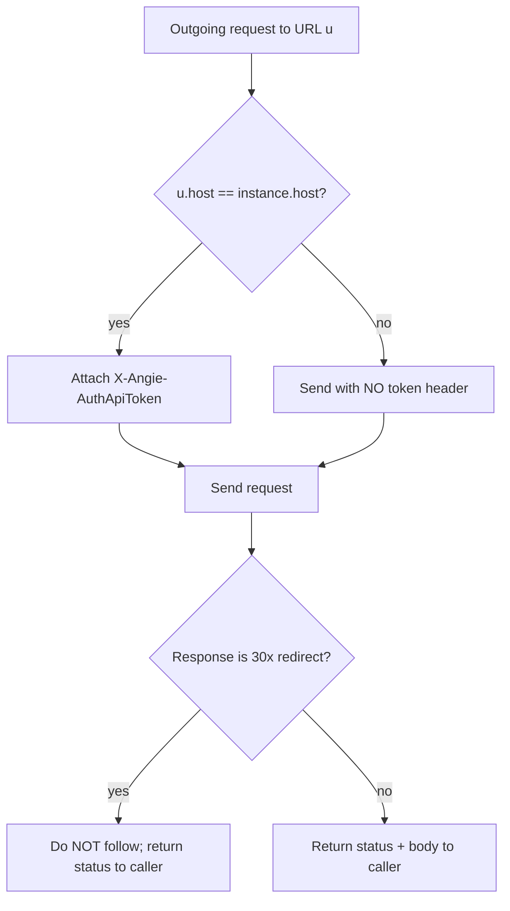

# 0002. Token host-isolation: the instance token reaches only its own host

<!-- Status lives in frontmatter. Observable security behavior delivered by
     slice R2; transport decision in ADR 0003. -->

## Context

Each configured instance carries a secret API token sent as the custom header
`X-Angie-AuthApiToken`. The non-negotiable security property (PRD 0001 security
NFR) is that this token must reach **only** that instance's host — it must never
leak to a third-party host, whether by a misaddressed request or by following a
redirect. Unlike `Authorization`/`Cookie`, the HTTP stack does not treat this
custom header as sensitive, so the protection must be explicit. This BDR pins the
observable behavior so the leak class cannot appear. It is delivered by slice R2
([Issue 0003](/issues/0003-r2-http-api-client.md)) and realized by the transport
in [ADR 0003](/adr/0003-http-transport-and-mocked-server-testing.md).

## Behavior

## Textual Description

- The token header is attached to an outgoing request **only when** the request
  URL's host equals the instance's host. A request to any other host is sent with
  no token header.
- The pre-auth token exchange (`issue-token`) is sent **without** any token, by
  definition — the token does not exist yet.
- A redirect response (`30x`) is **never** auto-followed. Its status is returned
  to the caller, so no second, redirect-driven request is ever issued — the token
  can never ride a cross-host redirect.
- An HTTP error *status* (4xx/5xx) is returned as data, not raised; only a
  transport failure (connect/DNS/TLS/timeout) is an error. (Parity with the Python
  `HttpClient`; included here because the security tests share the same seam.)

## Scenarios

**Scenario 1: same-host request carries the token**
- Given an instance whose host is `acme.example`
- When the client fetches a task from `https://acme.example/api/v1/...`
- Then the request carries `X-Angie-AuthApiToken`

**Scenario 2: foreign-host request carries no token**
- Given an instance whose host is `acme.example`
- When a request is issued to a different host
- Then the request carries **no** `X-Angie-AuthApiToken`

**Scenario 3: redirect to another host is not followed**
- Given the instance host responds `302` redirecting to a different host
- When the client makes the call
- Then the redirect is not followed, the second host receives **no** request, and
  the `302` status is returned to the caller

**Scenario 4: token exchange sends no token**
- Given setup has no token yet
- When the client posts to `issue-token`
- Then the request carries no `X-Angie-AuthApiToken` and the body is exactly
  `{username, password, client_name, client_vendor}`

**Scenario 5: HTTP error status is returned, not raised**
- Given the API answers `403`
- When the client makes the call
- Then the caller receives `(403, body)` and no exception/transport error

**Scenario 6: transport failure is an error**
- Given the host is unreachable
- When the client makes the call
- Then the call returns a transport error (not a status)

## Test Design

All cases run against a `wiremock` mock over the real `reqwest` + `rustls`
transport (ADR 0003); offline, deterministic.

| Case | Level | Input / scenario | Asserts (observable) | Proves |
|---|---|---|---|---|
| Happy path | integration | same-host fetch (Scenario 1) | mock received `X-Angie-AuthApiToken` | token reaches its own host |
| Negative (security) | integration | foreign-host request (Scenario 2) | no token header received | token never leaks to another host |
| Redirect non-follow | integration | `302` to a 2nd mock (Scenario 3) | 2nd host unhit; `302` returned | no token rides a cross-host redirect |
| Pre-auth | integration | `issue-token` post (Scenario 4) | no token header; exact body | exchange is tokenless and shape-correct |
| Status-as-data | integration | `403` response (Scenario 5) | `(403, body)` returned | error status is data, not an exception |
| Transport error | integration | unreachable host (Scenario 6) | `Err` transport failure | only transport failure raises |

## Related

- ADR: [/adr/0003-http-transport-and-mocked-server-testing.md](/adr/0003-http-transport-and-mocked-server-testing.md)
- PRD: [/prd/0001-rust-tui-cli-parity.md](/prd/0001-rust-tui-cli-parity.md)
- Issue: [/issues/0003-r2-http-api-client.md](/issues/0003-r2-http-api-client.md)
