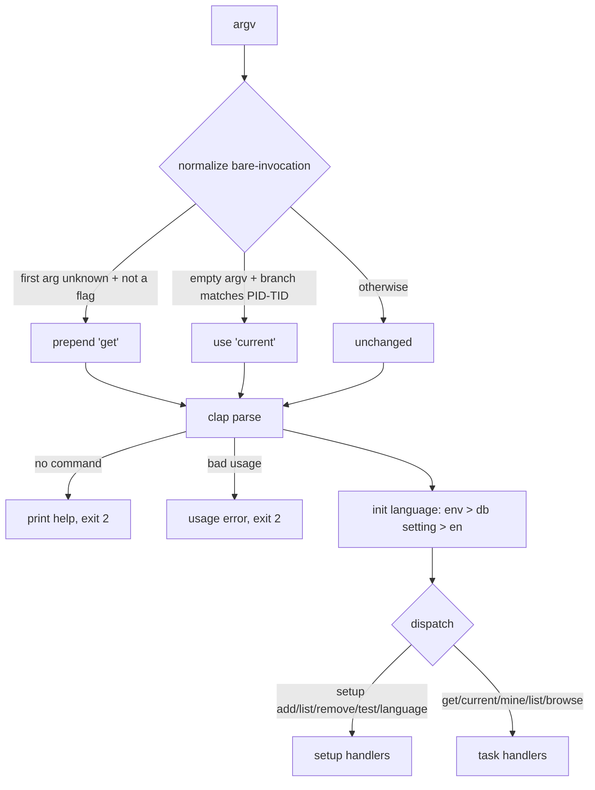

# 0003. CLI command-output parity: messages, exit codes, and bare-invocation

<!-- Status lives in frontmatter. Observable behavior delivered by slices R3a
     (scaffold/bare-invocation/i18n) and R3b (setup commands). -->

## Context

The Rust binary `ac` replaces the Python `active-collab` CLI. Existing users and
scripts depend on its command surface, human-readable messages, and exit codes.
This BDR pins the observable command contract so the Rust port is a drop-in
replacement. It is delivered by slice R3 ([Issue 0004](/issues/0004-r3-cli-setup-commands.md))
under [PRD 0001](/prd/0001-rust-tui-cli-parity.md), implementing
[ADR 0002](/adr/0002-rewrite-in-rust-with-ratatui.md). The oracle is
`src/active_collab/cli.py`.

## Behavior

## Textual Description

**Command surface (mirrors cli.py `_build_parser`):**
- `setup add` (`--name --url --email`, password prompted), `setup list`,
  `setup remove --name`, `setup test [--name]`, `setup language [code]`.
- `get <ref>`, `current`, `mine` (alias `list`), `browse`; the display flags
  `--instance --short --no-comments --json --refresh` apply to `get`/`current`.

**Bare-invocation normalization** (before the parser, mirrors `_normalize_argv`):
- A first argument that is **not** a known command and does **not** start with `-`
  is treated as a `get` ref → prepend `get`.
- **No** arguments, when the current git branch matches
  `(feature|hotfix|fix)/PROJECT_ID-TASK_ID`, resolves to `current`.
- Otherwise argv is unchanged.

**Language bootstrap** (mirrors `_init_language`): resolve from
`ACTIVE_COLLAB_LANG` env, else the DB `language` setting, else `en`; only a
supported code is honored; any DB read failure falls back silently to env/`en`.

**Exit codes (parity):** no command / bad usage / missing-or-ambiguous instance /
unsupported language / not-found instance → **2**; a runtime failure such as a
failed token exchange or HTTP error → **1**; success → **0**.

**Setup message contract (exact strings, each wrapped through `__()`):**
- add: `Instance '{name}' saved.`; on interactive add, a connectivity line
  `Connectivity: OK` / `Connectivity: FAILED (HTTP {status})` /
  `Connectivity: FAILED ({exc})`. Missing fields → `Error: --name, --url and
  --email are required.` (exit 2); missing password → `Error: password is
  required.` (exit 2); token failure → `Error: {detail}` (exit 1).
- list: header `NAME / URL / EMAIL / USER_ID` table, or `No instances configured.
  Run: active_collab.py setup add` when empty.
- remove: `Instance '{name}' removed.` or `Error: instance '{name}' not found.`
  (exit 2).
- test: per instance `  {name}: OK ({status})` / `  {name}: FAILED (HTTP
  {status})` / `  {name}: FAILED ({exc})`; any failure → exit 1; named missing →
  exit 2.
- language: no code → `Current language: {code}`; unsupported → `Error:
  unsupported language '{code}'. Supported: {supported}.` (exit 2); set →
  `Language set to '{code}'.`

## Scenarios

**Scenario 1: bare ref → get** — `ac 665/75159` is normalized to `get 665/75159`.
**Scenario 2: no args on a task branch → current** — empty argv on
`feature/665-75159` resolves to `current`.
**Scenario 3: no args, no command → help + exit 2** — empty argv with no matching
branch prints help and exits 2.
**Scenario 4: unsupported language → exit 2** — `setup language zz` prints the
unsupported-language error and exits 2.
**Scenario 5: remove missing instance → exit 2** — `setup remove --name nope`
prints not-found and exits 2.
**Scenario 6: setup list empty** — with no instances, prints the
`No instances configured...` line and exits 0.
**Scenario 7: language precedence** — env `ACTIVE_COLLAB_LANG` overrides the DB
setting which overrides `en`; an unsupported value is ignored.
**Scenario 8: setup add validation** — missing `--name/--url/--email`
(non-interactive) prints the required-fields error and exits 2.

## Test Design

Pure logic (normalization, language resolution, arg parsing) is unit-tested with
no I/O. Setup handlers are tested against a **temp SQLite store** (R1) and a
**wiremock** server (R2) by injecting the store path + HTTP base, so no real
network or `~/.config` write occurs. Each row names what it proves.

| Case | Level | Scenario | Asserts (observable) | Proves |
|---|---|---|---|---|
| Bare ref | unit | 1 | argv == ["get","665/75159"] | get shortcut |
| Bare branch | unit | 2 | argv == ["current"] | current shortcut |
| No-op normalize | unit | 3 | help printed, code 2 | no-command contract |
| Lang precedence | unit | 7 | env>db>en, unsupported ignored | resolution order |
| Lang unsupported | integration | 4 | error string, code 2 | validation + exit |
| Remove missing | integration | 5 | not-found string, code 2 | error path + exit |
| List empty | integration | 6 | empty-list string, code 0 | empty contract |
| Add validation | integration | 8 | required-fields string, code 2 | required-arg guard |
| Add happy path | integration | — | token exchanged (wiremock), instance saved, "saved." string, code 0 | success contract |
| Test connectivity | integration | — | OK/FAILED strings, exit 1 on failure | connectivity contract |

## Related

- PRD: [/prd/0001-rust-tui-cli-parity.md](/prd/0001-rust-tui-cli-parity.md)
- ADR: [/adr/0002-rewrite-in-rust-with-ratatui.md](/adr/0002-rewrite-in-rust-with-ratatui.md)
- Issue: [/issues/0004-r3-cli-setup-commands.md](/issues/0004-r3-cli-setup-commands.md)
