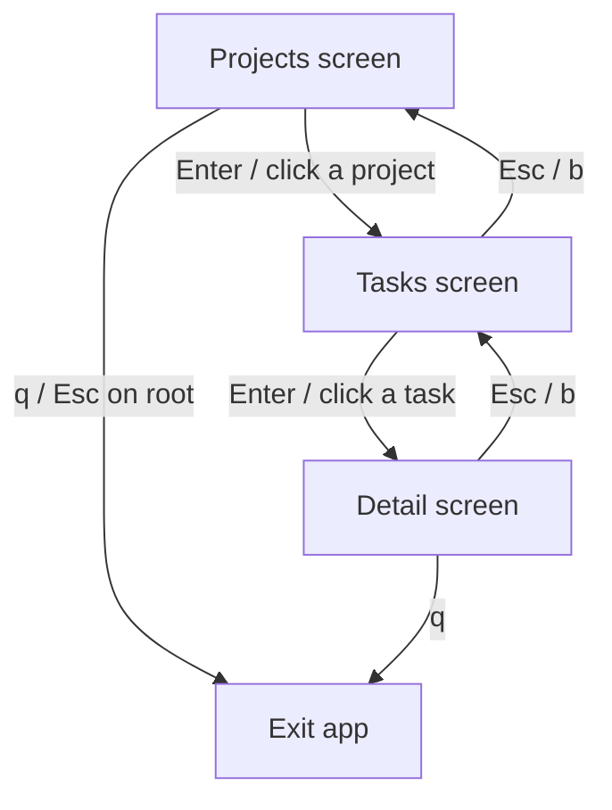

# 0004. Browse navigation: a screen stack with bounded selection across screens

## Context

The Rust binary `ac` reimplements the interactive browser. The Python oracle
(`src/active_collab/tui/`) models navigation as a pushdown stack of screens: a
`Screen` protocol with `handle(event, ctx) -> Transition` where `Transition` is
one of `Push | Pop | Replace | ExitApp | Stay`, and `App._loop` renders the top
screen, reads an event, applies the transition. This BDR pins the observable
navigation contract for the Rust port. It is delivered by slice R6
([Issue 0007](/issues/0007-r6-browse-tui-parity.md)) under
[PRD 0001](/prd/0001-rust-tui-cli-parity.md), implementing
[ADR 0002](/adr/0002-rewrite-in-rust-with-ratatui.md). Mouse/scroll/bounded
selection carry over from [BDR 0001](/bdr/0001-task-list-navigation.md).

R6 covers three screens — **Projects**, **Tasks**, **Detail**. The Settings and
Asset screens are out of scope here (delivered by R7, i18n + assets).

## Behavior

## Textual Description

**Stack model (pure).** The TEA `Model` owns `stack: Vec<Screen>`, where each
`Screen` variant carries its own state (selection index, scroll offset, data,
loading flag). The top of the stack is the active screen. `update(Model, Msg)`
returns `(Model, Vec<Cmd>)`: navigation messages mutate the stack purely; data
loads are expressed as `Cmd` effects (see [BDR 0005](/bdr/0005-loader-single-flight-refresh.md)).

**Transitions (mirror the Python `Transition` union):**
- **Push** — selecting a project pushes a Tasks screen; selecting a task pushes
  a Detail screen.
- **Pop** — `Esc` or `b` pops the top screen; popping the root exits.
- **Exit** — `q` exits from any screen; `Esc`/`b` on the root screen also exits.
- **Stay** — every other message leaves the stack depth unchanged.

**Selection and scroll (per BDR 0001, on every screen):**
- `Up`/`Down`/`j`/`k` move the selection, **bounded** to `[0, len-1]`; movement
  on an empty list is a no-op.
- Mouse wheel scrolls; a left click selects the row under the cursor, clamped to
  the last row.
- **Over-scroll, over-move, and clicks never exit the app** and never set
  `should_quit` — only an explicit `q` (or popping the root) exits.

**Key bindings (shared, from the Python `events` map):** `Up/Down/j/k` move,
`Enter` select/push, `Esc`/`b` back/pop, `q` quit, mouse scroll/click. `r`
(refresh) and `s` (settings) are bound but `s` is inert until R7.

## Scenarios

**Scenario 1: drill in** — on Projects, `Enter` on a project pushes Tasks; on
Tasks, `Enter` on a task pushes Detail (stack depth 1 → 2 → 3).
**Scenario 2: pop back** — `Esc` on Detail pops to Tasks; `Esc` on Tasks pops to
Projects (depth 3 → 2 → 1).
**Scenario 3: exit at root** — `q` on any screen, or `Esc` on the root Projects
screen, exits the app.
**Scenario 4: bounded selection** — `Up` at row 0 stays at 0; `Down` at the last
row stays at the last row; both on every screen.
**Scenario 5: over-scroll is safe** — wheel-scroll past either end, and a click
below the last row, never exit and never panic on any screen.
**Scenario 6: empty list** — navigation messages on an empty list are no-ops and
never panic.

## Test Design

The stack and selection logic live in the pure `update` layer and are unit-tested
headless (no terminal, no async): push/pop depth, bounded selection, over-scroll
safety, and empty-list safety per screen. The crossterm event loop that maps raw
events to `Msg` and drives `update` is the untestable shell and is kept minimal.

| Case | Level | Scenario | Asserts (observable) | Proves |
|---|---|---|---|---|
| Drill in | unit | 1 | stack depth grows Projects→Tasks→Detail | Push |
| Pop back | unit | 2 | stack depth shrinks, top screen restored | Pop |
| Exit at root | unit | 3 | should_quit set on q / Esc-at-root | Exit |
| Bounded up/down | unit | 4 | selection clamped per screen | BDR 0001 |
| Over-scroll safe | unit | 5 | no exit, no panic on any screen | safety NFR |
| Empty list | unit | 6 | no-op, no panic | safety NFR |

## Related

- PRD: [/prd/0001-rust-tui-cli-parity.md](/prd/0001-rust-tui-cli-parity.md)
- ADR: [/adr/0002-rewrite-in-rust-with-ratatui.md](/adr/0002-rewrite-in-rust-with-ratatui.md)
- BDR: [/bdr/0001-task-list-navigation.md](/bdr/0001-task-list-navigation.md),
  [/bdr/0005-loader-single-flight-refresh.md](/bdr/0005-loader-single-flight-refresh.md)
- Issue: [/issues/0007-r6-browse-tui-parity.md](/issues/0007-r6-browse-tui-parity.md)
