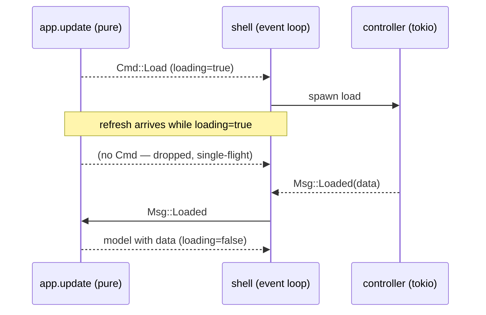

# 0005. Loader and single-flight refresh: effects as Cmd, one in-flight load per screen

## Context

The browse TUI fetches over the network: tasks-by-project for the list and task
detail for the detail screen. The Python oracle shows a `LoadingIndicator` while
a Textual `@work(thread=True)` worker fetches, and guards refresh with
`@work(exclusive=True, group="detail")` so a refresh requested while one is in
flight does not start a second — it is dropped. This BDR pins that observable
behavior for the Rust port (slice R6, [Issue 0007](/issues/0007-r6-browse-tui-parity.md);
[PRD 0001](/prd/0001-rust-tui-cli-parity.md) responsiveness NFR;
[ADR 0002](/adr/0002-rewrite-in-rust-with-ratatui.md)).

## Behavior

## Textual Description

**Effects as data.** `update(Model, Msg) -> (Model, Vec<Cmd>)`. A `Cmd` is a
pure description of an effect (`Cmd::LoadTasksByProject`, `Cmd::LoadDetail {
project_id, task_id, refresh }`). The shell interprets each `Cmd` by spawning a
tokio controller task; when the task completes it feeds a `Msg::Loaded…` back
into `update`. The pure layer never performs I/O.

**Loader.** Each loadable screen carries `loading: bool`. Emitting a load `Cmd`
sets `loading = true`; the matching `Msg::Loaded` sets it `false` and stores the
data. The view renders a loading indicator while `loading` is true.

**Single-flight (the guard).** When a screen is already loading, a refresh (`r`)
or a re-entrant load message produces **no new `Cmd`** and leaves `loading`
true — the duplicate is dropped, not queued. Because this decision is made
entirely inside `update`, it is unit-testable without async: assert that
`update(model_with_loading_true, Refresh)` returns an empty `Vec<Cmd>`.

**Refresh semantics.** On the detail screen, `r` emits `Cmd::LoadDetail { …,
refresh: true }` **only when not already loading**, and resets the scroll offset
to 0. `refresh: true` bypasses the cache (always fetch); `refresh: false` lets
the controller serve a cache hit without network (local-first, parity with R4).

## Scenarios

**Scenario 1: loader during fetch** — entering a loadable screen sets
`loading=true` and emits exactly one load `Cmd`; the view shows the indicator.
**Scenario 2: load completes** — `Msg::Loaded` stores the data and sets
`loading=false`; the indicator disappears.
**Scenario 3: single-flight refresh** — `r` while `loading=true` emits no `Cmd`
and the stack/loading state is unchanged (the second request is dropped).
**Scenario 4: refresh when idle** — `r` while `loading=false` emits one
`Cmd::LoadDetail { refresh: true }`, sets `loading=true`, and resets scroll to 0.
**Scenario 5: refresh bypasses cache** — a `refresh: true` load always fetches;
a `refresh: false` load serves a cache hit without a network call.

## Test Design

The loader flag and the single-flight guard are pure and unit-tested headless.
The controller's cache-vs-fetch behavior is tested against a temp SQLite cache
(R1) + wiremock (R2) by asserting the mock is hit on `refresh: true` and not hit
on a `refresh: false` cache hit. The tokio spawn/channel plumbing in the shell is
the untestable seam and is kept minimal.

| Case | Level | Scenario | Asserts (observable) | Proves |
|---|---|---|---|---|
| Loader on enter | unit | 1 | loading=true, one Cmd emitted | loader state |
| Loaded clears | unit | 2 | loading=false, data stored | completion |
| Single-flight | unit | 3 | refresh while loading → empty Cmd vec | the guard |
| Refresh idle | unit | 4 | one LoadDetail{refresh:true}, offset=0 | refresh |
| Cache vs fetch | integration | 5 | mock hit iff refresh=true | local-first |

## Related

- PRD: [/prd/0001-rust-tui-cli-parity.md](/prd/0001-rust-tui-cli-parity.md)
- ADR: [/adr/0002-rewrite-in-rust-with-ratatui.md](/adr/0002-rewrite-in-rust-with-ratatui.md)
- BDR: [/bdr/0004-browse-navigation-screen-stack.md](/bdr/0004-browse-navigation-screen-stack.md)
- Issue: [/issues/0007-r6-browse-tui-parity.md](/issues/0007-r6-browse-tui-parity.md)
