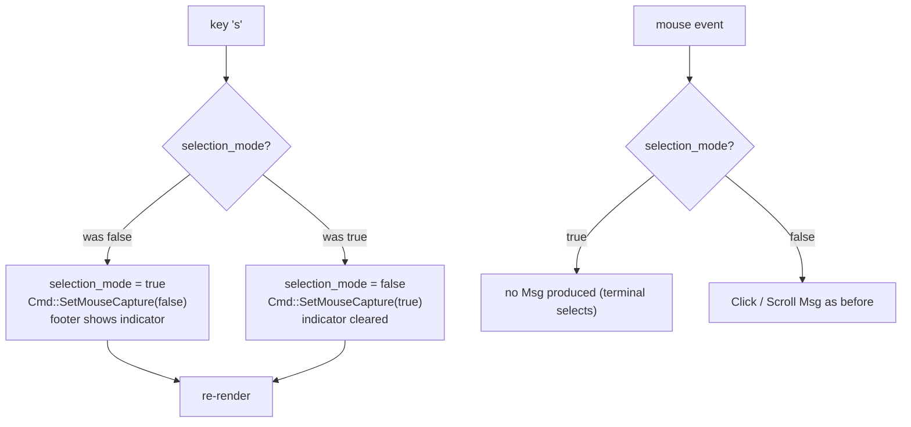

# 0006. Selection mode: mouse-capture toggle with footer feedback

<!-- Status lives in frontmatter. Observable behavior delivered by slice V3. -->

## Context

Mouse capture (on for the whole session) lets the TUI handle clicks (drill in,
open assets, open links) but blocks the terminal's native click-drag text
selection. This BDR pins the observable behavior of the **selection mode** that
lets an operator copy on-screen text on demand. It is delivered by slice V3
([Issue 0010](/issues/0010-v3-text-selection-mode.md)) under
[ADR 0012](/adr/0012-mouse-capture-toggle-for-text-selection.md);
the effect-as-`Cmd` model follows [BDR 0005](/bdr/0005-loader-single-flight-refresh.md).

## Behavior

## Textual Description

The pure `update` carries `selection_mode: bool` (default `false`).

- **`s` toggles the mode.** Entering selection mode sets `selection_mode = true`
  and emits exactly one `Cmd::SetMouseCapture(false)`; leaving it sets `false` and
  emits one `Cmd::SetMouseCapture(true)`.
- **Footer feedback.** While `selection_mode` is true the footer renders a visible
  indicator (`SELEÇÃO` / `SELECTION`); while false the indicator is absent. The
  footer hint advertises the `s` key on every screen.
- **Mouse behavior.** While selection mode is on, the terminal is not forwarding
  mouse events to the app, so no `Click`/`Scroll` `Msg` is produced — the terminal
  performs its own selection. Keyboard navigation is unaffected in both modes.
- **Teardown safety.** Terminal restore disables mouse capture unconditionally, so
  the guard is correct regardless of the toggle's last value.

## Scenarios

**Scenario 1: enter selection mode** — Given `selection_mode` is false, When the
user presses `s`, Then `selection_mode` becomes true and exactly one
`Cmd::SetMouseCapture(false)` is emitted.

**Scenario 2: leave selection mode** — Given `selection_mode` is true, When the
user presses `s`, Then `selection_mode` becomes false and exactly one
`Cmd::SetMouseCapture(true)` is emitted.

**Scenario 3: footer indicator reflects the mode** — Given `selection_mode` is
true, When the footer renders, Then the selection indicator is shown; when false,
it is absent.

**Scenario 4: keyboard still works in selection mode** — Given `selection_mode` is
true, When the user presses Up/Down/Enter/`b`, Then navigation behaves exactly as
in normal mode (no exit, correct state change).

**Scenario 5: toggle is idempotent in pairs** — Given any starting mode, When the
user presses `s` twice, Then the mode returns to its starting value and the net
emitted captures cancel (off then on, or on then off).

## Test Design

The toggle, the emitted `Cmd`, and the footer-indicator state are pure and
unit-tested headless against `update()` / the view builder. The actual
`Enable/DisableMouseCapture` execution is the untestable shell seam and is kept
minimal. Each row names what it proves.

| Case | Level | Scenario | Asserts (observable) | Proves |
|---|---|---|---|---|
| Enter mode | unit | 1 | selection_mode==true, one SetMouseCapture(false) | enter contract |
| Leave mode | unit | 2 | selection_mode==false, one SetMouseCapture(true) | leave contract |
| Indicator on | unit | 3 | footer contains the indicator when true | feedback shown |
| Indicator off | unit | 3 | footer omits the indicator when false | feedback cleared |
| Keyboard in mode | unit | 4 | nav Msg changes state as normal, no quit | mode is mouse-only |
| Idempotent pair | unit/property | 5 | two `s` returns to start, captures net out | toggle invariant |

## Related

- ADR: [/adr/0012-mouse-capture-toggle-for-text-selection.md](/adr/0012-mouse-capture-toggle-for-text-selection.md)
- BDR: [/bdr/0005-loader-single-flight-refresh.md](/bdr/0005-loader-single-flight-refresh.md)
- Issue: [/issues/0010-v3-text-selection-mode.md](/issues/0010-v3-text-selection-mode.md)
