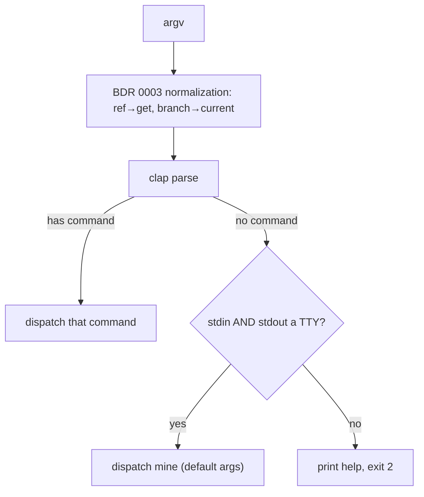

# 0007. Bare invocation in a TTY defaults to `mine`

<!-- Status lives in frontmatter. Amends BDR 0003 Scenario 3
     (no-args bare invocation). Delivered by slice C1. -->

## Context

[BDR 0003](/bdr/0003-cli-command-output-parity.md) Scenario 3 pinned "no args, no
matching branch → help + exit 2". The user asked that a bare `ac` at a terminal
open the personal task view (`mine`) instead. This BDR **amends** BDR 0003
Scenario 3 for the interactive case while keeping the non-interactive contract
intact. It is delivered by slice C1
([Issue 0011](/issues/0011-c1-bare-ac-tty-default-mine.md)) under
[ADR 0013](/adr/0013-tty-gated-default-subcommand.md). The pre-parser
normalizations of BDR 0003 (bare ref → `get`, task branch → `current`) are
unchanged and still run first.

## Behavior

## Textual Description

When parsing yields **no subcommand** (empty argv, no `get`/`current`
normalization applied):

- **Both stdin and stdout are a TTY** → dispatch `mine` with default arguments,
  identical to typing `ac mine` (which then does its own TTY-vs-table decision).
- **Either stream is redirected/piped** → print help and exit 2, exactly as
  before (BDR 0003 Scenario 3 for the non-TTY case).

Every explicit subcommand (`get`, `current`, `mine`, `browse`, `setup …`) and the
two bare-invocation normalizations are unchanged. Exit codes for the non-TTY path
are unchanged (2).

## Scenarios

**Scenario 1: bare `ac` at a terminal → mine** — Given no argv and both streams are
a TTY, When `ac` runs, Then it dispatches `mine` (no help, no exit 2).

**Scenario 2: bare `ac` piped → help + exit 2** — Given no argv and stdout (or
stdin) is not a TTY, When `ac` runs, Then it prints help and exits 2.

**Scenario 3: explicit subcommand unaffected** — Given `ac browse` (or any
subcommand), When it runs, Then it dispatches that command regardless of TTY-ness.

**Scenario 4: bare ref still normalizes to get** — Given `ac 665/75159`, When it
runs, Then BDR 0003's `get` normalization applies (the new default only covers the
empty-argv path).

**Scenario 5: task-branch bare invocation still resolves to current** — Given empty
argv on a `feature/665-75159` branch, When `ac` runs, Then BDR 0003's `current`
normalization applies (it runs before the no-command default).

## Test Design

The TTY decision is injected (a boolean seam) so the routing is unit-tested without
a real terminal; the normalization precedence is the existing BDR 0003 unit
coverage. Each row names what it proves.

| Case | Level | Scenario | Asserts (observable) | Proves |
|---|---|---|---|---|
| TTY bare → mine | unit | 1 | routes to Mine(default) when tty=true | interactive default |
| Non-TTY bare → help | unit | 2 | help printed, exit 2 when tty=false | pipe/script contract kept |
| Subcommand passthrough | unit | 3 | explicit command dispatched, no TTY gate | no regression |
| Ref normalization precedence | unit | 4 | argv==["get", ref] before default applies | order preserved |
| Branch normalization precedence | unit | 5 | argv==["current"] before default applies | order preserved |

## Related

- ADR: [/adr/0013-tty-gated-default-subcommand.md](/adr/0013-tty-gated-default-subcommand.md)
- BDR: [/bdr/0003-cli-command-output-parity.md](/bdr/0003-cli-command-output-parity.md) (amended — Scenario 3)
- Issue: [/issues/0011-c1-bare-ac-tty-default-mine.md](/issues/0011-c1-bare-ac-tty-default-mine.md)
