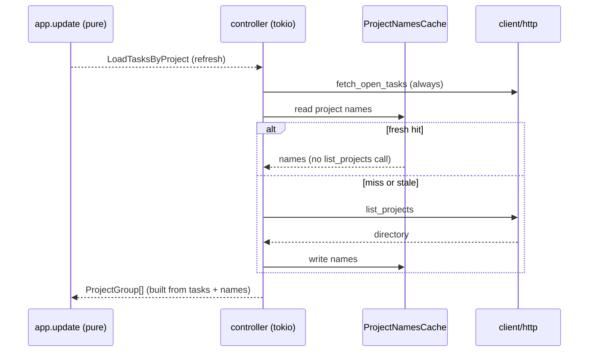

# 0008. Browse-list refresh: fresh tasks, cached project directory

<!-- Status lives in frontmatter. Observable behavior delivered by slice R2. -->

## Context

A list refresh today re-fetches the entire project directory of every instance
(`list_projects`) on top of the open-tasks call, uncached, making `r` slow. This
BDR pins the observable network behavior of the cached path. Delivered by slice R2
([Issue 0012](/issues/0012-r2-browse-list-project-name-cache.md)) under
[ADR 0014](/adr/0014-browse-list-project-name-cache-swr.md); refines the refresh
behavior of [BDR 0005](/bdr/0005-loader-single-flight-refresh.md).

## Behavior

## Textual Description

On `Cmd::LoadTasksByProject` (entry or refresh), per instance:

- **Open tasks are always fetched** from the network — refresh exists to make the
  listing current.
- **Project names come from `ProjectNamesCache`** (per instance, TTL):
  - a **fresh** entry is used directly — **no `list_projects` request**;
  - a **miss or stale** entry triggers one `list_projects`, then a cache write.
- `build_groups` maps `project_id → name`, falling back to the numeric id when a
  name is missing, so a cold cache degrades gracefully (numeric ids, then names).
- The single-flight loader guard ([BDR 0005](/bdr/0005-loader-single-flight-refresh.md))
  is unchanged: a refresh while loading is still dropped.

## Scenarios

**Scenario 1: warm refresh skips the directory** — Given a fresh
`ProjectNamesCache` for an instance, When a list refresh runs, Then
`fetch_open_tasks` is called and `list_projects` is **not** called; names come from
cache.

**Scenario 2: cold cache fetches the directory once** — Given no (or stale) cache
entry, When a list load runs, Then `list_projects` is called once and the result is
written to the cache.

**Scenario 3: open tasks are always fresh** — Given any cache state, When a refresh
runs, Then `fetch_open_tasks` is always called (the listing is never served stale).

**Scenario 4: missing name degrades to id** — Given a task whose `project_id` has
no cached name, When the group is built, Then the group label is the numeric
`project_id` and nothing panics.

**Scenario 5: per-instance isolation** — Given two instances with colliding
`project_id`s, When names are cached, Then each instance reads its own names (no
cross-instance leakage).

**Scenario 6: name isolation end-to-end across the in-memory merge (amendment,
issue 0018)** — Given two instances that both expose `project_id = N` with
**different** project names, When the browse list is built (cache read → in-memory
merge → `build_groups`), Then each instance's group shows **its own** name. This
closes the gap where Scenario 5 held at the cache layer but `tasks_by_project`
re-flattened the per-instance maps into one `project_id`-keyed map (clobbering the
collision back in). See [Issue 0018](/issues/0018-b1-multi-instance-project-name-isolation.md).

## Test Design

The cache-vs-fetch decision is tested against a temp SQLite cache (R1) + the mocked
server (R2): assert the directory endpoint is hit on a cold/stale entry and **not**
hit on a warm entry, and that the open-tasks endpoint is hit every time. Group
fallback and per-instance isolation are pure/unit. Each row names what it proves.

| Case | Level | Scenario | Asserts (observable) | Proves |
|---|---|---|---|---|
| Warm refresh | integration | 1 | list_projects mock NOT hit; tasks mock hit | directory cached, latency removed |
| Cold load | integration | 2 | list_projects hit once, cache written | miss path + write-back |
| Tasks always fresh | integration | 3 | tasks mock hit on every refresh | refresh keeps listing current |
| Name fallback | unit | 4 | group label == project_id, no panic | graceful cold-cache degradation |
| Per-instance isolation | unit | 5 | each instance reads its own names | no pid cross-leak |
| Name isolation end-to-end | unit | 6 | 2 instances, same pid, different names → each group shows its own name | merge keyed by (instance, pid), not pid alone |

## Related

- ADR: [/adr/0014-browse-list-project-name-cache-swr.md](/adr/0014-browse-list-project-name-cache-swr.md)
- BDR: [/bdr/0005-loader-single-flight-refresh.md](/bdr/0005-loader-single-flight-refresh.md)
- Issue: [/issues/0012-r2-browse-list-project-name-cache.md](/issues/0012-r2-browse-list-project-name-cache.md)
- Issue (amendment, Scenario 6): [/issues/0018-b1-multi-instance-project-name-isolation.md](/issues/0018-b1-multi-instance-project-name-isolation.md)
