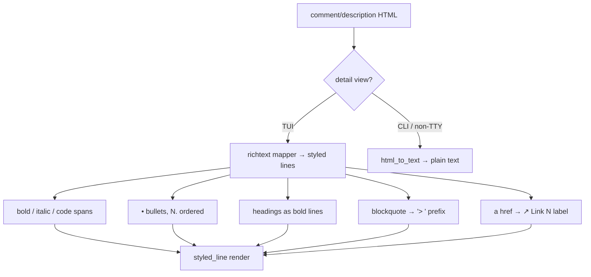

# 0009. Rich-text formatting in the detail view

<!-- Status lives in frontmatter. Observable behavior delivered by slice R3. -->

## Context

Comments and descriptions arrive as HTML and are flattened by `html_to_text` in
the detail view, losing bullets, emphasis, headings, and quotes. This BDR pins the
observable rendering of the preserved subset. Delivered by slice R3
([Issue 0013](/issues/0013-r3-richtext-formatting.md)) under
[ADR 0015](/adr/0015-richtext-html-subset-styled-segments.md). Links continue to
use the V4 `↗ Link N` label ([ADR 0009](/adr/0009-tui-visual-redesign-vibrant-dashboard.md)).

## Behavior

## Textual Description

In the **TUI detail view**, the HTML subset maps as:

- `<strong>`/`<b>` → bold span; `<em>`/`<i>` → italic span; `<code>` → a distinct
  (dim) span.
- `<h1>`–`<h6>` → a bold line.
- `<ul>`/`<ol>` with `<li>` → one line per item, prefixed `• ` (ordered lists use
  `N. `).
- `<blockquote>` → each line prefixed `> `.
- `<a href>` → the existing `↗ Link N` clickable label.
- `
`/`
`/` ` → line breaks (as today).
- any other tag → stripped (as today); malformed HTML never panics.

Wrapping is **style-aware**: a span's style is preserved when a long line wraps.
The **CLI / non-TTY** path (`render_task_to_str`, `get`/`current`) keeps
`html_to_text` plain output unchanged (BDR 0003 parity).

## Scenarios

**Scenario 1: bold and italic** — Given a comment `<strong>A</strong> <em>b</em>`,
When the detail view renders, Then `A` carries a bold style and `b` an italic
style.

**Scenario 2: unordered list** — Given `<ul><li>one</li><li>two</li></ul>`, When
rendered, Then two lines appear, each prefixed `• `.

**Scenario 3: ordered list** — Given `<ol><li>a</li><li>b</li></ol>`, When
rendered, Then lines are prefixed `1. ` and `2. `.

**Scenario 4: heading** — Given `<h2>Title</h2>`, When rendered, Then `Title` is a
bold line.

**Scenario 5: blockquote** — Given `<blockquote>quoted</blockquote>`, When
rendered, Then the line is prefixed `> `.

**Scenario 6: link becomes a label** — Given `<a href="https://x/y">text</a>`, When
rendered, Then a `↗ Link N` label appears and resolves to `https://x/y` (V4).

**Scenario 7: malformed HTML is safe** — Given unbalanced/unknown tags, When
rendered, Then the text degrades to stripped content with no panic.

**Scenario 8: CLI path unchanged** — Given the same HTML, When rendered for
`get`/non-TTY output, Then the plain `html_to_text` result is produced (no styles).

**Scenario 9: style survives wrapping** — Given a bold span longer than the
viewport width, When the line wraps, Then every wrapped fragment keeps the bold
style.

## Test Design

The mapper is pure and unit-tested on representative HTML fixtures asserting the
emitted styled segments / line prefixes; the CLI parity case asserts the plain path
is untouched. Each row names what it proves.

| Case | Level | Scenario | Asserts (observable) | Proves |
|---|---|---|---|---|
| Inline emphasis | unit | 1 | segments carry bold / italic styles | inline-tag mapping |
| Unordered list | unit | 2 | two `• ` lines | list bullets |
| Ordered list | unit | 3 | `1. ` / `2. ` prefixes | ordered numbering |
| Heading | unit | 4 | bold heading line | heading mapping |
| Blockquote | unit | 5 | `> ` prefix | quote mapping |
| Link label | unit | 6 | `↗ Link N` + resolved URL | V4 link reuse |
| Malformed safe | unit/property | 7 | no panic, stripped text | robustness |
| CLI parity | unit | 8 | plain html_to_text output unchanged | non-TTY parity |
| Wrap keeps style | unit | 9 | wrapped fragments keep style | style-aware wrap |

## Related

- ADR: [/adr/0015-richtext-html-subset-styled-segments.md](/adr/0015-richtext-html-subset-styled-segments.md)
- ADR: [/adr/0009-tui-visual-redesign-vibrant-dashboard.md](/adr/0009-tui-visual-redesign-vibrant-dashboard.md)
- BDR: [/bdr/0003-cli-command-output-parity.md](/bdr/0003-cli-command-output-parity.md)
- Issue: [/issues/0013-r3-richtext-formatting.md](/issues/0013-r3-richtext-formatting.md)
