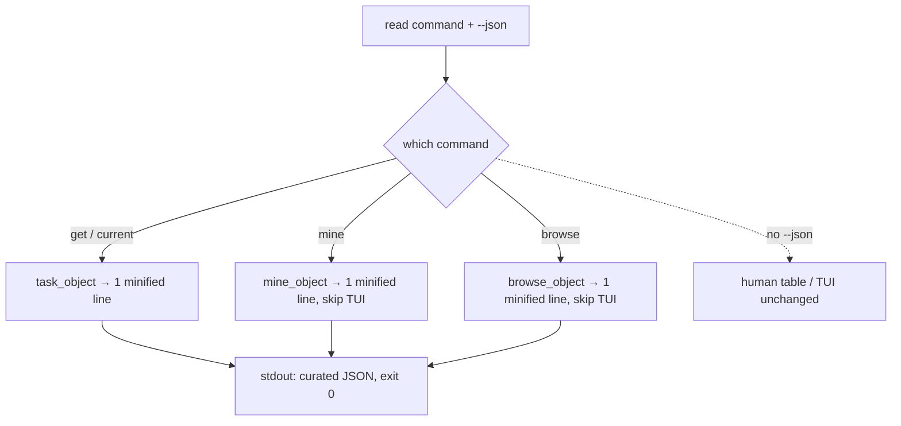

# 0010. Agent JSON output contract

<!-- Status lives in frontmatter. Observable behavior delivered by slice U21 (J1-J3). -->

## Context

Agents and scripts need a stable, low-token, non-interactive way to read task
data. This BDR pins the observable output of the `--json` flag across the read
commands. Delivered by slice U21
([Issue 0015](/issues/0015-u21-agent-json-output.md)) under
[ADR 0011](/adr/0011-agent-json-output-contract.md). The human-readable output is
governed by [BDR 0003](/bdr/0003-cli-command-output-parity.md) and is unchanged.

## Behavior

## Textual Description

- **`get` / `current` `--json`** emit exactly **one minified line** matching the
  ADR 0011 task schema: `ref` (`PROJECT_ID/TASK_ID`), `instance`, `project_id`,
  `task_id`, `name`, `status` (literal `"open"`/`"completed"` from `is_completed`),
  `assignee` (resolved name or `null`), `assignee_id` (or `null`), `project_name`,
  `start_on`/`due_on` (`null` when absent), `estimate_hours`, `logged_hours`,
  `url`, `description` (HTML stripped via `html_to_text`), `assets`, and
  `comments` (`[]` when `--no-comments` or none). The path is **cache-aware** and
  honors `--refresh` and `--no-comments`.
- **`mine --json`** emits one minified line `{count, tasks:[…]}` and **never
  launches the TUI**, even on a TTY.
- **`browse --json`** emits one minified line `{projects:[…]}` (each project with
  `task_count` and its `tasks`) and **never launches the TUI**, even on a TTY.
- Fields are derived with the **same helpers as the human renderer**
  (`html_to_text`, `fmt_date`, `fmt_ts`, `fmt_hours`, `controller::extract_assets`)
  so JSON and text never drift.
- The **human (non-`--json`) paths are unchanged** (BDR 0003 parity).

## Scenarios

**Scenario 1: get --json is one curated minified line** — Given a task, When `get
REF --json` runs, Then stdout is a single line of compact JSON matching the task
schema (no pretty indentation), and the process exits 0.

**Scenario 2: ref round-trips** — Given `mine --json` or `browse --json` output,
When an agent takes any task's `ref`, Then `get <ref>` accepts it unchanged.

**Scenario 3: status and assignee are machine values** — Given a completed task
and an unassigned task, When rendered with `--json`, Then `status` is
`"completed"`/`"open"` (not a translated label) and `assignee`/`assignee_id` are
the resolved name+id or `null`.

**Scenario 4: --no-comments and null dates** — Given `--no-comments` (or a task
with no comments) and absent `start_on`/`due_on`, When rendered with `--json`,
Then `comments` is `[]` and the absent dates are `null`.

**Scenario 5: mine --json skips the TUI** — Given a TTY, When `mine --json` runs,
Then the curated `{count,tasks}` line is printed and the TUI is **not** launched.

**Scenario 6: browse --json skips the TUI** — Given a TTY, When `browse --json`
runs, Then the curated `{projects}` line (with `task_count` + tasks) is printed and
the TUI is **not** launched.

**Scenario 7: cache-aware** — Given a cached task, When `get --json` runs without
`--refresh`, Then it serves from cache; with `--refresh` it re-fetches — same
cache behavior as the human path.

**Scenario 8: human output unchanged** — Given no `--json`, When any read command
runs, Then the human table/TUI output is exactly as before (BDR 0003 parity).

## Test Design

The shaping functions (`task_object`, `mine_object`, `browse_object`) are **pure**
and unit-tested over `serde_json::Value` / `MineTableRow` / `ProjectGroup` fixtures
with no network: assert exact field presence, null handling, `status`/`assignee`
mapping, `ref` form, and that the output is single-line (no `\n`, no indent). The
non-interactive `mine`/`browse` `--json` branch is tested at the command layer
(prints the line, does not launch the TUI). The human paths' existing tests guard
parity. Each row names what it proves.

| Case | Level | Scenario | Asserts (observable) | Proves |
|---|---|---|---|---|
| get task_object | unit | 1,3,4,7 | exact fields, null dates, status/assignee, one line | curated schema + minified |
| ref round-trip | unit | 2 | `ref` == `project_id/task_id` (get's form) | chainable across commands |
| no-comments / null | unit | 4 | `comments` == [], absent dates null | flag + absence handling |
| mine_object | unit | 5 | `{count,tasks[]}` shape, refs | mine schema |
| browse_object | unit | 6 | `{projects[]}` with task_count + tasks | browse schema |
| mine --json non-TTY | unit/cmd | 5 | line printed, TUI not launched on TTY | non-interactive forcing |
| browse --json non-TTY | unit/cmd | 6 | line printed, TUI not launched on TTY | non-interactive forcing |
| human parity | unit | 8 | non-`--json` output unchanged | BDR 0003 parity |

## Related

- ADR: [/adr/0011-agent-json-output-contract.md](/adr/0011-agent-json-output-contract.md)
- BDR: [/bdr/0003-cli-command-output-parity.md](/bdr/0003-cli-command-output-parity.md)
- Issue: [/issues/0015-u21-agent-json-output.md](/issues/0015-u21-agent-json-output.md)
