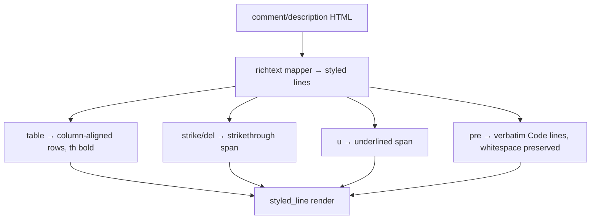

# 0013. Rich-text: full ActiveCollab tag coverage in the detail view

<!-- Status lives in frontmatter. Observable behavior delivered by slice R4. -->

## Context

[BDR 0009](/bdr/0009-richtext-formatting-detail-view.md) pinned the first richtext
subset. This BDR extends it to the rest of ActiveCollab's allowed-tag whitelist —
tables, strikethrough, underline, and preformatted blocks — which the current mapper
strips. Delivered by slice R4 ([Issue 0019](/issues/0019-r4-richtext-full-tag-coverage.md))
under [ADR 0019](/adr/0019-richtext-full-activecollab-tag-coverage.md). The CLI
plain-text path ([BDR 0003](/bdr/0003-cli-command-output-parity.md)) is unchanged.

## Behavior

## Textual Description

In the **TUI detail view**, the additional HTML maps as:

- `<strike>`/`<del>` → a strikethrough-styled span; `<u>` → an underlined span.
- `<pre>` → a verbatim block: inner lines emitted as-is with internal whitespace
  preserved, each styled as code, framed by a blank line above and below. Inline
  emphasis inside `<pre>` still applies.
- `<table>` → column-aligned text rows: each `<tr>` is one line; `<td>`/`<th>` are
  cells padded (in display-width) to the widest cell per column with a two-space
  gutter; `<th>` cells render bold; framed by a blank line above and below.
- Ragged/degenerate tables never panic; a missing cell is empty.
- Everything from BDR 0009 still holds; genuinely unknown tags still strip safely.

Wrapping stays **style-aware**. The **CLI / non-TTY** path keeps `html_to_text`
unchanged.

## Scenarios

**Scenario 1: strikethrough** — Given `<del>gone</del>`, When the detail view
renders, Then `gone` carries a strikethrough style.

**Scenario 2: underline** — Given `<u>under</u>`, When rendered, Then `under` carries
an underline style.

**Scenario 3: preformatted preserves whitespace** — Given
`<pre>a    b\n  c</pre>`, When rendered, Then the internal spaces and the line break
are preserved and the lines are code-styled.

**Scenario 4: simple table aligns columns** — Given a 2×2 `<table>` with `<th>`
headers, When rendered, Then two rows appear, columns are aligned to the widest cell,
and the header cells are bold.

**Scenario 5: ragged table is safe** — Given a table whose rows have differing cell
counts, When rendered, Then no panic and missing cells render empty.

**Scenario 6: CLI path unchanged** — Given the same HTML, When rendered for
`get`/non-TTY output, Then the plain `html_to_text` result is produced (no styles).

**Scenario 7: style survives wrapping** — Given a struck/underlined span longer than
the viewport, When the line wraps, Then every wrapped fragment keeps the style.

## Test Design

The mapper is pure and unit-tested on representative HTML fixtures asserting the
emitted styled segments / line structure; the CLI parity case asserts the plain path
is untouched. Each row names what it proves.

| Case | Level | Scenario | Asserts (observable) | Proves |
|---|---|---|---|---|
| Strikethrough | unit | 1 | span carries strike style | strike/del mapping |
| Underline | unit | 2 | span carries underline style | u mapping |
| Preformatted | unit | 3 | whitespace + newline preserved, code style | pre verbatim block |
| Table aligned | unit | 4 | aligned rows, th bold | table layout |
| Ragged table | unit/property | 5 | no panic, empty missing cells | table robustness |
| CLI parity | unit | 6 | plain html_to_text unchanged | non-TTY parity |
| Wrap keeps style | unit | 7 | wrapped fragments keep style | style-aware wrap |

## Related

- ADR: [/adr/0019-richtext-full-activecollab-tag-coverage.md](/adr/0019-richtext-full-activecollab-tag-coverage.md)
- BDR: [/bdr/0009-richtext-formatting-detail-view.md](/bdr/0009-richtext-formatting-detail-view.md)
- BDR: [/bdr/0003-cli-command-output-parity.md](/bdr/0003-cli-command-output-parity.md)
- Research: [/research/0001-tui-richtext-links-selection.md](/research/0001-tui-richtext-links-selection.md)
- Issue: [/issues/0019-r4-richtext-full-tag-coverage.md](/issues/0019-r4-richtext-full-tag-coverage.md)
