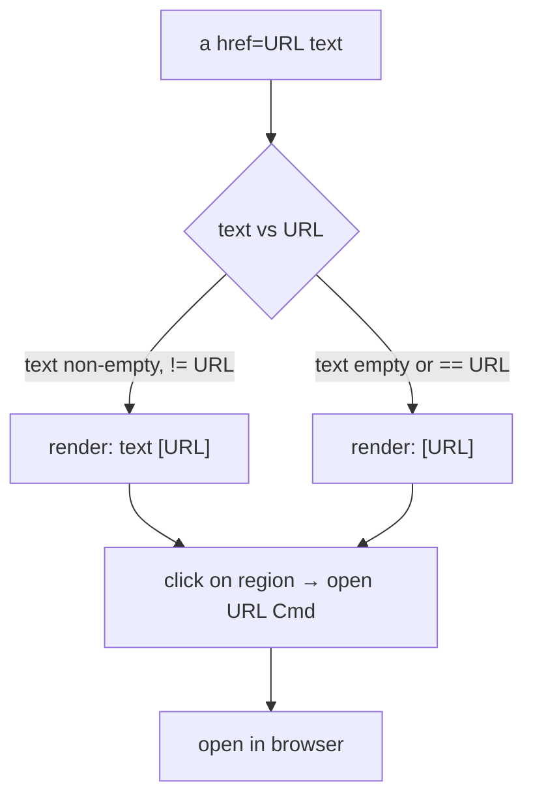

# 0014. Body links: inline URL + activation from the visible region

<!-- Status lives in frontmatter. Observable behavior delivered by slice V5. -->

## Context

Body links rendered as `↗ Link N` hid the URL and made clicking depend on a fragile
column→label mapping, so clicks "mostly don't work". This BDR pins the new observable
behavior: inline `text [url]`, clickable where visible. Delivered by slice V5
([Issue 0020](/issues/0020-v5-body-links-inline-url.md)) under
[ADR 0020](/adr/0020-body-links-inline-url-native-click.md). Asset/"Anexo" affordances
are unchanged.

## Behavior

## Textual Description

In the **TUI detail view**:

- `<a href="URL">text</a>` renders the anchor `text` styled as a link (link color +
  underline) followed by ` [URL]` with the URL dimmed.
- When `text` is empty or equals the URL, only `[URL]` is rendered.
- `mailto:` URLs render the address.
- Clicking anywhere on the rendered link region (`text [URL]`) emits the open-URL
  `Cmd` for that link. The mapping is from the visible region, so any cell of the
  link is a valid target.
- The URL text is on screen, so it is selectable/copyable (BDR 0015) and terminals
  with URL detection make it Cmd/Ctrl+clickable natively.
- The `↗ Link N` label and the separate URL list are **gone for body links**.

The **CLI / non-TTY** path is unchanged.

## Scenarios

**Scenario 1: text and URL differ** — Given `<a href="https://x/y">docs</a>`, When
rendered, Then `docs [https://x/y]` appears with `docs` link-styled and the URL
dimmed.

**Scenario 2: text equals URL** — Given `<a href="https://x/y">https://x/y</a>`, When
rendered, Then only `[https://x/y]` appears (no duplication).

**Scenario 3: empty anchor text** — Given ``, When rendered,
Then `[https://x/y]` appears.

**Scenario 4: click opens the URL** — Given a rendered link region, When a click lands
on any cell of that region, Then the open-URL `Cmd` for that URL is emitted.

**Scenario 5: mailto** — Given `<a href="mailto:a@b.com">mail</a>`, When rendered,
Then `mail [a@b.com]` appears and clicking emits the open `Cmd`.

**Scenario 6: wrapping keeps the region clickable** — Given a link whose `text [URL]`
exceeds the viewport width, When the line wraps, Then a click on a wrapped fragment
still maps to the same URL.

## Test Design

Rendering is pure and unit-tested on the mapper output; click mapping is tested on the
pure `body_link_cmd_at` against rendered geometry. Each row names what it proves.

| Case | Level | Scenario | Asserts (observable) | Proves |
|---|---|---|---|---|
| Text != URL | unit | 1 | `text [url]`, link + dim styles | inline render |
| Text == URL | unit | 2 | `[url]` only | no duplication |
| Empty text | unit | 3 | `[url]` only | empty-anchor handling |
| Click opens | unit | 4 | region click → open Cmd with URL | robust click mapping |
| Mailto | unit | 5 | `mail [a@b.com]` + open Cmd | mailto handling |
| Wrapped clickable | unit | 6 | wrapped fragment → same URL | wrap-aware mapping |

## Related

- ADR: [/adr/0020-body-links-inline-url-native-click.md](/adr/0020-body-links-inline-url-native-click.md)
- ADR: [/adr/0009-tui-visual-redesign-vibrant-dashboard.md](/adr/0009-tui-visual-redesign-vibrant-dashboard.md)
- BDR: [/bdr/0009-richtext-formatting-detail-view.md](/bdr/0009-richtext-formatting-detail-view.md) (link row superseded)
- BDR: [/bdr/0015-app-managed-text-selection.md](/bdr/0015-app-managed-text-selection.md)
- Issue: [/issues/0020-v5-body-links-inline-url.md](/issues/0020-v5-body-links-inline-url.md)
