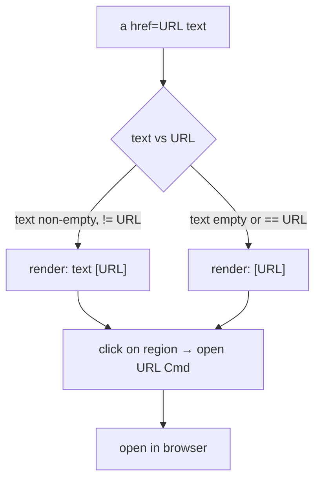

# 0014. Body links: inline URL + activation from the visible region

<!-- Status lives in frontmatter. Observable behavior delivered by slice V5. -->

## Context

Body links rendered as `↗ Link N` hid the URL and made clicking depend on a fragile
column→label mapping, so clicks "mostly don't work". This BDR pins the new observable
behavior: inline `text [url]`, clickable where visible. Delivered by slice V5
([Issue 0020](/issues/0020-v5-body-links-inline-url.md)) under
[ADR 0020](/adr/0020-body-links-inline-url-native-click.md). Asset/"Anexo" affordances
are unchanged.

## Behavior

## Textual Description

In the **TUI detail view**:

- `<a href="URL">text</a>` renders the anchor `text` as normal body text (inline
  emphasis preserved) followed by ` [URL]`; the bracketed URL is the link-styled
  (link color), visible, clickable, copyable token.
- When `text` is empty or equals the URL, only `[URL]` is rendered.
- `mailto:` URLs render the bare address in the brackets (`text [a@b.com]`); the
  open `Cmd` re-adds the `mailto:` scheme.
- The **visible URL token** is the click target: clicking the `[URL]` bracket
  content (or a raw URL printed in the body) emits the open `Cmd` for that URL.
  The target is derived from the visible text at the click column — no indirected
  "Link N" index to correlate (that indirection was the source of the missed
  clicks). A bracketed e-mail address opens via `mailto:`.
- The URL text is on screen, so it is selectable/copyable (BDR 0015) and terminals
  with URL detection make it Cmd/Ctrl+clickable natively. A URL long enough to wrap
  across lines stays fully visible and copyable. **Amended (D1c):** an app-side click
  on **any wrapped fragment** of that URL opens the **full** URL — the click maps to
  the pre-wrap logical line before the URL token is resolved (V5 resolved only a click
  on a single unwrapped line; real-terminal use showed the terminal-native fallback was
  not enough).
- The `↗ Link N` label and the separate URL list are **gone for body links**.

The **CLI / non-TTY** path is unchanged.

## Scenarios

**Scenario 1: text and URL differ** — Given `<a href="https://x/y">docs</a>`, When
rendered, Then `docs [https://x/y]` appears, with the bracketed `[https://x/y]`
link-styled (link color) as the clickable/copyable token and `docs` as normal text.

**Scenario 2: text equals URL** — Given `<a href="https://x/y">https://x/y</a>`, When
rendered, Then only `[https://x/y]` appears (no duplication).

**Scenario 3: empty anchor text** — Given ``, When rendered,
Then `[https://x/y]` appears.

**Scenario 4: click on the URL token opens it** — Given a rendered `text [URL]` link,
When a click lands on the `[URL]` token (or on a raw URL printed in the body), Then the
open-URL `Cmd` for that URL is emitted.

**Scenario 5: mailto** — Given `<a href="mailto:a@b.com">mail</a>`, When rendered,
Then `mail [a@b.com]` appears and clicking the `[a@b.com]` token emits the open `Cmd`
for `mailto:a@b.com`.

**Scenario 6: long URL stays visible and copyable** — Given a URL long enough to wrap,
When the body renders, Then the full URL is on screen across the wrapped lines
(selectable/copyable).

**Scenario 7 (D1c): click on a wrapped fragment opens the full URL** — Given a body URL
long enough to wrap across two or more rendered lines, When a click lands on **any** of
those wrapped fragments, Then the open `Cmd` for the **complete** URL is emitted (the
click maps to the pre-wrap logical line, where the whole token is resolvable).

## Test Design

Rendering is pure and unit-tested on the mapper output; click mapping is tested on the
pure `body_link_cmd_at` against rendered geometry. Each row names what it proves.

| Case | Level | Scenario | Asserts (observable) | Proves |
|---|---|---|---|---|
| Text != URL | unit | 1 | `text [url]`; bracketed url link-styled | inline render |
| Text == URL | unit | 2 | `[url]` only | no duplication |
| Empty text | unit | 3 | `[url]` only | empty-anchor handling |
| Click opens | unit | 4 | URL-token click → open Cmd with URL | url-from-click (no index) |
| Mailto | unit | 5 | `mail [a@b.com]` + open Cmd `mailto:a@b.com` | mailto handling |
| Long URL visible | unit | 6 | full URL present across wrapped lines | URL always visible/copyable |
| Wrapped click (D1c) | unit | 7 | click on a wrapped fragment → open Cmd with the FULL url | pre-wrap logical-line click mapping |

## Related

- ADR: [/adr/0020-body-links-inline-url-native-click.md](/adr/0020-body-links-inline-url-native-click.md)
- ADR: [/adr/0009-tui-visual-redesign-vibrant-dashboard.md](/adr/0009-tui-visual-redesign-vibrant-dashboard.md)
- BDR: [/bdr/0009-richtext-formatting-detail-view.md](/bdr/0009-richtext-formatting-detail-view.md) (link row superseded)
- BDR: [/bdr/0015-app-managed-text-selection.md](/bdr/0015-app-managed-text-selection.md)
- Issue: [/issues/0020-v5-body-links-inline-url.md](/issues/0020-v5-body-links-inline-url.md)
