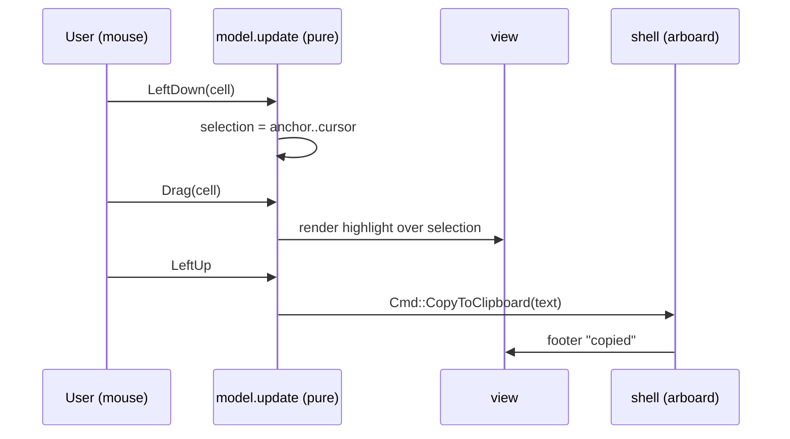

# 0015. App-managed text selection with drawn highlight + clipboard copy

<!-- Status lives in frontmatter. Observable behavior delivered by slice V6. -->

## Context

[BDR 0006](/bdr/0006-selection-mode-mouse-capture-toggle.md) (slice V3) specified a
key that toggles mouse capture off so the *terminal* selects text — which means the
app cannot draw any feedback. This BDR replaces that with app-managed selection: the
app keeps capture on, draws the highlight itself, and copies to the clipboard.
Delivered by slice V6 ([Issue 0021](/issues/0021-v6-app-managed-selection.md)) under
[ADR 0021](/adr/0021-app-managed-text-selection-clipboard.md), superseding BDR 0006.

## Behavior

## Textual Description

In the **detail view**, mouse capture stays on:

- **Left button down** on the body starts a selection (anchor = cursor = cell).
- **Drag** (move with button held) extends the cursor; the selection spans anchor→
  cursor in reading order.
- While a selection exists, the selected cells render with a **reverse-video /
  highlighted background** — visible feedback as the operator drags.
- **Left button up** finalizes and emits `Cmd::CopyToClipboard(text)`; the footer
  shows a brief **copied** confirmation.
- A **click with no drag** is not a selection — it keeps the existing click
  semantics (drill-in / open link / open asset).
- Clipboard failure (headless/no display) degrades to a footer note; selection and
  highlight still work.

The `s` selection mode, the mouse-capture toggle, and the `selection_mode` indicator
from V3 are **removed**.

## Scenarios

**Scenario 1: drag highlights** — Given the body is visible, When the operator
presses and drags across text, Then the covered cells render highlighted.

**Scenario 2: release copies** — Given an active selection, When the button is
released, Then `Cmd::CopyToClipboard` is emitted with the selected text.

**Scenario 3: click is not selection** — Given a single click with no movement, When
released, Then no copy occurs and the click's normal action (drill-in/open) runs.

**Scenario 4: reading-order span** — Given a drag from a later cell back to an earlier
cell, When extended, Then the selection text is in reading order (anchor/cursor
normalized).

**Scenario 5: copy failure degrades** — Given the clipboard is unavailable, When a
selection is released, Then the app does not panic and shows a footer note; selection
state is unaffected.

**Scenario 6: old toggle gone** — Given the `s` key, When pressed, Then no
mouse-capture toggle occurs (the V3 behavior is removed).

## Test Design

Selection state transitions and text extraction are pure and unit-tested on
`update`; the clipboard write is asserted as an emitted `Cmd` (the effect itself is
the shell's, not unit-tested). Highlight rendering is asserted via the TestBackend
buffer. Each row names what it proves.

| Case | Level | Scenario | Asserts (observable) | Proves |
|---|---|---|---|---|
| Drag selects | unit | 1 | model selection spans dragged cells | press/drag state |
| Highlight drawn | render (TestBackend) | 1 | selected cells styled reversed | drawn feedback |
| Release copies | unit | 2 | `Cmd::CopyToClipboard(text)` emitted | copy effect as data |
| Click not selection | unit | 3 | no copy Cmd; click action runs | click vs drag |
| Reading order | unit | 4 | normalized anchor/cursor text | order normalization |
| Copy failure safe | unit/integration | 5 | no panic; footer note | graceful degrade |
| Toggle removed | unit | 6 | `s` emits no capture Cmd | V3 retired |

## Related

- ADR: [/adr/0021-app-managed-text-selection-clipboard.md](/adr/0021-app-managed-text-selection-clipboard.md)
- BDR: [/bdr/0006-selection-mode-mouse-capture-toggle.md](/bdr/0006-selection-mode-mouse-capture-toggle.md) (superseded by this)
- Research: [/research/0001-tui-richtext-links-selection.md](/research/0001-tui-richtext-links-selection.md)
- Issue: [/issues/0021-v6-app-managed-selection.md](/issues/0021-v6-app-managed-selection.md)
