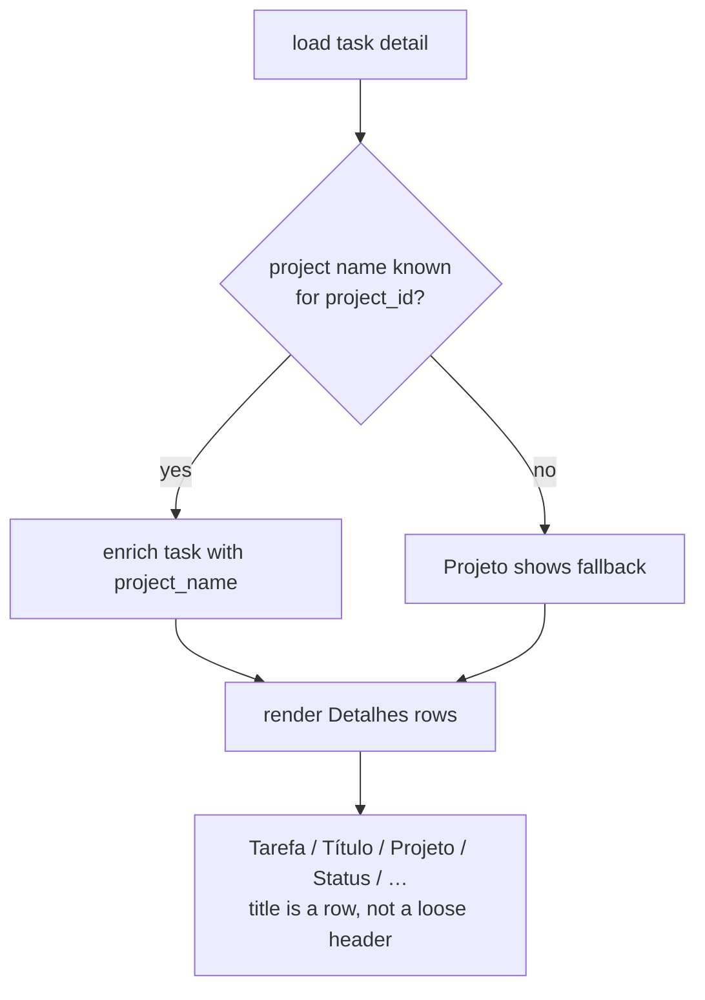

# 0016. Detail Título row + populated Projeto

## Context

The detail screen floated the task title as a loose line above the bordered `Detalhes`
panel, and the `Projeto` row rendered empty because the detail task JSON was never
enriched with its project name. This BDR pins the corrected observable layout, delivered
by slice D1a ([Issue 0022](/issues/0022-detail-link-wrap-artifacts-project-title.md))
under [ADR 0022](/adr/0022-detail-title-as-meta-row.md). The project name is resolved
from the per-instance `ProjectNamesCache` already used by the browse/mine list
([ADR 0014](/adr/0014-browse-list-project-name-cache-swr.md)).

## Behavior

## Textual Description

In the **TUI detail view**, inside the `Detalhes` panel:

- The first rows are `Tarefa` (task id/short form) then **`Título`** (the task title),
  in that order. The title is a labeled meta row — there is **no** loose title line
  rendered above the bordered panel.
- The `Projeto` row shows the **resolved project name** for the task's `project_id`,
  looked up from the per-instance project-name cache. When the name is genuinely unknown
  (cache miss with no directory yet), the row shows the existing fallback rather than a
  blank value.
- The remaining rows (`Status`, `Responsável`, `Início`, `Prazo`, `Estimativa`,
  `Registrado`) are unchanged.
- All rows wrap on narrow widths ([BDR 0012](/bdr/0012-detail-chrome-responsive-wrap.md)).

The **CLI / non-TTY** path is unchanged.

## Scenarios

**Scenario 1: title is a row after Tarefa** — Given a task with title `OSV-Scanner`,
When the detail renders, Then the `Detalhes` panel shows a `Tarefa` row followed
immediately by a `Título` row reading `OSV-Scanner`, and no title line appears above the
panel border.

**Scenario 2: project name populated** — Given a task whose `project_id` resolves to
`Base · Sustentação` in the project-name cache, When the detail renders, Then the
`Projeto` row shows `Base · Sustentação` (not blank).

**Scenario 3: project name unknown** — Given a task whose `project_id` has no cached
name, When the detail renders, Then the `Projeto` row shows the defined fallback (never
an empty value).

> **Refined by [BDR 0030](/bdr/0030-detail-project-name-resolved-on-miss.md)
> ([ADR 0056](/adr/0056-detail-project-name-network-fallback.md)):** Scenario 3's
> cache miss now first resolves the name over the network (one
> `GET /api/v1/projects/{id}`) and writes it back to the cache; the fallback shown
> here appears only when that fetch also yields no name. The `Título`/`Projeto`
> layout below is unchanged.

**Scenario 4: long title wraps** — Given a title longer than the panel width, When the
detail renders on a narrow terminal, Then the `Título` row wraps within the panel like
any other row.

## Test Design

Rendering is pure and unit-tested on the detail-content builder output; project-name
enrichment is tested on the load path that injects the name before rendering.

| Case | Level | Scenario | Asserts (observable) | Proves |
|---|---|---|---|---|
| Título row order | unit | 1 | `Título` row present, directly after `Tarefa` | title is a meta row |
| No loose header | unit | 1 | no title line rendered above the panel | loose header removed |
| Projeto populated | unit | 2 | `Projeto` row value == resolved name | enrichment applied |
| Projeto fallback | unit | 3 | `Projeto` row == fallback, not empty | no blank value |
| Title wraps | unit | 4 | wrapped `Título` fragments within panel | row wrapping |

## Related

- ADR: [/adr/0022-detail-title-as-meta-row.md](/adr/0022-detail-title-as-meta-row.md)
- ADR: [/adr/0014-browse-list-project-name-cache-swr.md](/adr/0014-browse-list-project-name-cache-swr.md) (project-name cache reused)
- BDR: [/bdr/0012-detail-chrome-responsive-wrap.md](/bdr/0012-detail-chrome-responsive-wrap.md)
- Issue: [/issues/0022-detail-link-wrap-artifacts-project-title.md](/issues/0022-detail-link-wrap-artifacts-project-title.md)
