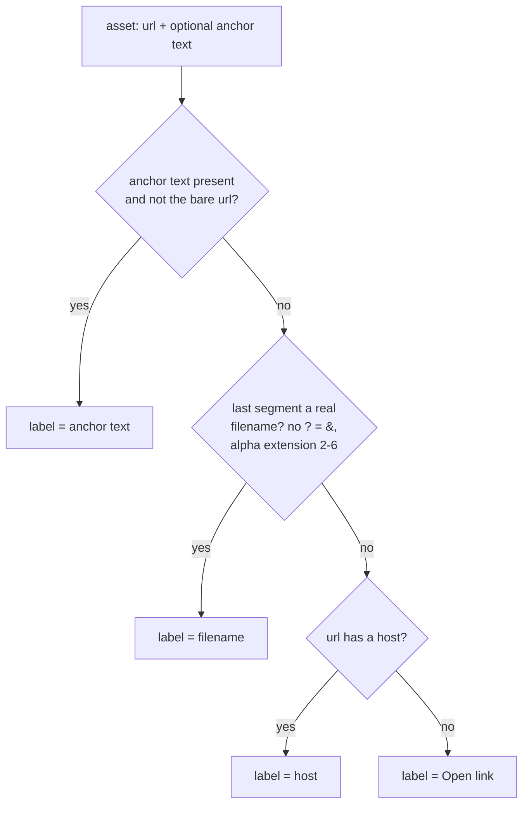

# 0017. Asset label derivation

## Context

The `Anexos/Artefatos` panel showed a Google Docs link as `[1] ↗ edit?tab=t.0` — the
URL's query tail mistaken for a filename. This BDR pins the corrected observable label,
delivered by slice D1b ([Issue 0022](/issues/0022-detail-link-wrap-artifacts-project-title.md))
under [ADR 0023](/adr/0023-asset-label-derivation.md). Which URLs become assets is
unchanged; only the label changes.

## Behavior

## Textual Description

In the **Anexos/Artefatos** panel, each `[N] ↗ <label>` row derives `<label>` by the
first rule that yields a meaningful string:

1. **Anchor text** — if the asset came from `<a href=…>text</a>` and `text` is non-empty
   and not equal to the bare URL, the label is `text`.
2. **Real filename** — else, if the URL's last path segment is a genuine downloadable
   filename — contains no `?`, `=`, or `&`; has a dot followed by a 2–6 character
   alphabetic extension (so `.0`, `.123` do **not** qualify); within the length bound —
   the label is that filename.
3. **Host** — else, the label is the URL host (`docs.google.com`). If no host parses,
   the label is the existing `Open link`.

A query-string tail is **never** shown as a label. The `[N] ↗` numbering and
click-to-open behavior are unchanged; the full URL remains inline in the body (V5).

## Scenarios

**Scenario 1: web link with no useful basename → host** — Given an asset from
`https://docs.google.com/document/d/ABC/edit?tab=t.0` with no distinct anchor text, When
the panel renders, Then the row reads `↗ docs.google.com` (never `edit?tab=t.0`).

**Scenario 2: real file → filename** — Given an asset from `https://x/uploads/relatorio.pdf`,
When the panel renders, Then the row reads `↗ relatorio.pdf`.

**Scenario 3: anchor text present → text** — Given an asset from
`<a href="https://x/y">Especificação V1</a>`, When the panel renders, Then the row reads
`↗ Especificação V1`.

**Scenario 4: numeric/query tail rejected** — Given a last segment `edit?tab=t.0` or
`page.0`, When the label is derived, Then it is **not** used as a filename (falls through
to host).

## Test Design

Label derivation is pure and unit-tested on the asset-row builder.

| Case | Level | Scenario | Asserts (observable) | Proves |
|---|---|---|---|---|
| Host fallback | unit | 1 | label == `docs.google.com` | query tail rejected → host |
| Real filename | unit | 2 | label == `relatorio.pdf` | genuine file kept |
| Anchor text | unit | 3 | label == `Especificação V1` | anchor text preferred |
| Query tail rejected | unit | 4 | `edit?tab=t.0` not used as filename | tightened filename test |

## Related

- ADR: [/adr/0023-asset-label-derivation.md](/adr/0023-asset-label-derivation.md)
- ADR: [/adr/0016-refactor-render-decompose-relocate.md](/adr/0016-refactor-render-decompose-relocate.md) (extraction unchanged)
- BDR: [/bdr/0014-body-link-inline-url-activation.md](/bdr/0014-body-link-inline-url-activation.md) (full URL inline in body)
- Issue: [/issues/0022-detail-link-wrap-artifacts-project-title.md](/issues/0022-detail-link-wrap-artifacts-project-title.md)
