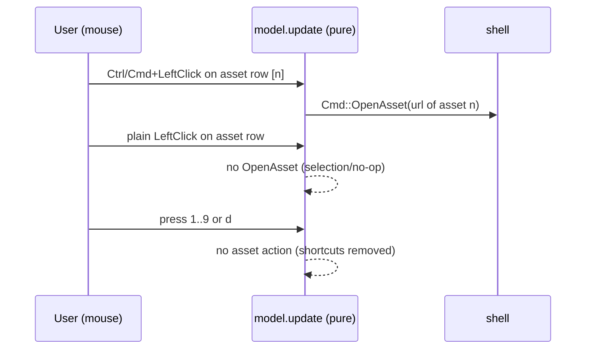

# 0019. Assets open on Ctrl/Cmd+click; numeric shortcuts removed

## Context

Detail assets were opened/downloaded by numeric keyboard shortcuts (`1`–`9` open, `d` then
`1`–`9` download), which cannot address a tenth asset and hide a download mode. Delivered by
slice **D1e** ([Issue 0024](/issues/0024-d1e-asset-activation-ctrl-cmd-click.md)) under
[ADR 0025](/adr/0025-asset-activation-ctrl-cmd-click.md), adopting the D1c body-link gate
([BDR 0014](/bdr/0014-body-link-inline-url-activation.md)).

## Behavior

## Textual Description

In the **detail view's Anexos/Artefatos card**:

- A **Ctrl/Cmd/Super+left-click** on an asset row opens that asset (`Cmd::OpenAsset` with
  the asset's URL). The clicked row resolves to the correct asset for any asset count.
- A **plain (unmodified) left-click** on an asset row does **not** open the asset — plain
  pointer gestures are reserved for text selection (V6), matching the D1c rule that a plain
  click does not activate a body link.
- The **numeric shortcuts are gone**: pressing `1`–`9` performs no asset action, and there
  is no `d` download mode (`pending_download` removed). No keyboard combination opens or
  downloads an asset.
- The **footer hint** no longer advertises `1-9 open asset` / `d+1-9 download`; it reflects
  the Ctrl/Cmd+click activation (or simply omits the retired affordances).
- In-TUI **download is removed** (it existed only via the numeric prefix); opening in the
  browser via Ctrl/Cmd+click remains.

## Scenarios

**Scenario 1: Ctrl/Cmd+click opens the asset** — Given the detail asset card with assets,
When the operator Ctrl/Cmd/Super+left-clicks the row of asset [n], Then `Cmd::OpenAsset` is
emitted with asset n's URL.

**Scenario 2: plain click does not open** — Given the asset card, When the operator
left-clicks an asset row without a modifier, Then no `Cmd::OpenAsset` (and no download) is
emitted.

**Scenario 3: numeric open removed** — Given the detail view, When the operator presses a
digit `1`–`9`, Then no asset is opened (no `Cmd::OpenAsset`, no `Msg::AssetOpen`).

**Scenario 4: numeric download removed** — Given the detail view, When the operator presses
`d` and then a digit, Then no download mode is entered and no `Cmd::DownloadAsset` is emitted
(the `pending_download` state and the `DownloadAsset` command no longer exist).

**Scenario 5: footer reflects the new model** — Given the detail view with assets, When the
footer renders, Then it does not show `1-9 open asset` / `d+1-9 download` (or their pt-BR
equivalents).

**Scenario 6: click maps to the correct asset for >9 assets** — Given a card with ten or
more assets, When the operator Ctrl/Cmd+clicks the tenth asset's row, Then asset ten opens —
a count the numeric scheme could never reach.

## Test Design

Mapping and message handling are pure and unit-tested on `update`; the open effect is
asserted as an emitted `Cmd`. Each row names what it proves.

| Case | Level | Scenario | Asserts (observable) | Proves |
|---|---|---|---|---|
| Ctrl/Cmd+click opens | unit | 1 | `Cmd::OpenAsset(asset n url)` emitted on modified click | modifier-gated open |
| Plain click no open | unit | 2 | no `OpenAsset`/download on unmodified click | plain reserved for selection |
| Digit does nothing | unit | 3 | pressing `1`–`9` emits no asset Cmd | numeric open removed |
| `d`+digit does nothing | unit | 4 | no download mode, no `DownloadAsset` | numeric download + state removed |
| Footer reworded | render/unit | 5 | hint string omits the numeric affordances | footer reflects model |
| Tenth asset opens | unit | 6 | Ctrl/Cmd+click on row of asset 10 opens asset 10 | scales beyond nine |

## Related

- ADR: [/adr/0025-asset-activation-ctrl-cmd-click.md](/adr/0025-asset-activation-ctrl-cmd-click.md)
- BDR: [/bdr/0014-body-link-inline-url-activation.md](/bdr/0014-body-link-inline-url-activation.md) (D1c Ctrl/Cmd+click precedent)
- BDR: [/bdr/0018-asset-card-breathing-room.md](/bdr/0018-asset-card-breathing-room.md) (the card this activates)
- Issue: [/issues/0024-d1e-asset-activation-ctrl-cmd-click.md](/issues/0024-d1e-asset-activation-ctrl-cmd-click.md)
