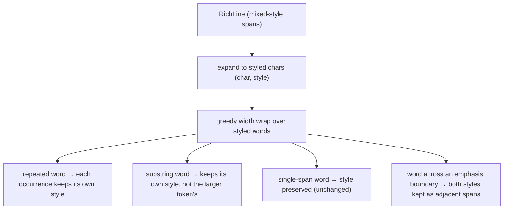

# 0023. Rich-text wrap preserves each word's own emphasis (repeated + substring words)

<!-- Status lives in frontmatter. Implements ADR 0030. -->

## Context

[BDR 0013](/bdr/0013-richtext-full-tag-coverage.md) Sc.7 pinned that a styled span
keeps its style across a wrap, tested with a single long span. It did not cover a
line that **mixes** styles — and the wrap implementation re-derived each wrapped
word's style by scanning the source spans for the first one whose text *contains*
the word ([ADR 0030](/adr/0030-richtext-wrap-positional-style.md) Context). That
substring lookup picks the wrong style when a word repeats with different emphasis,
or when a short word is a substring of a larger styled token. This BDR pins the
corrected observable behavior. The CLI plain-text path
([BDR 0003](/bdr/0003-cli-command-output-parity.md)) is unchanged — it never styles.

## Behavior

## Textual Description

When a `RichLine` is wrapped to a display width:

- Each wrapped fragment's emphasis is that of its **source position**, not of the
  first span that textually contains the word.
- A word that occurs **more than once** in the same source line with **different**
  emphasis keeps **each occurrence's own** style.
- A word that is a **substring** of a larger styled token elsewhere on the line does
  **not** inherit that token's style.
- A word that straddles an **emphasis boundary** keeps **both** styles, as adjacent
  spans within the wrapped line.
- A line of a **single** span (the BDR 0013 Sc.7 case) is unchanged: every wrapped
  fragment keeps that span's style.
- The inter-word space inserted at a wrap join is unstyled (Plain), as before.
- Empty, whitespace-only, and over-width (hard-split) inputs behave exactly as
  before; `wrap_rich`'s signature and edges are unchanged.

## Scenarios

**Scenario 1: repeated word, different emphasis** — Given a line whose spans are
`format the ` (Plain), `format` (Bold), ` call` (Plain), When it wraps wide enough to
stay on one line, Then the **first** `format` renders Plain and the **second**
`format` renders Bold (each occurrence keeps its own style).

**Scenario 2: substring word does not inherit** — Given a line with a Plain word
`cat` and, elsewhere, a Bold span `category`, When it wraps, Then `cat` renders Plain
(it does not take `category`'s Bold).

**Scenario 3: single-span style survives wrap (unchanged)** — Given one Bold span
longer than the width, When it wraps across rows, Then every wrapped fragment is
Bold (BDR 0013 Sc.7 still holds).

**Scenario 4: word across an emphasis boundary** — Given spans `fo` (Bold) then `o`
(Plain) with no whitespace between (one display word `foo`), When it wraps, Then the
fragment keeps `fo` Bold and `o` Plain as adjacent spans (no single style swallows
the word).

**Scenario 5: emphasis lands on the right side of a break** — Given a line that
wraps between two words where the word **after** the break is the styled one, When it
wraps, Then the styled word on the next row keeps its style and the word before the
break keeps its own (style is not carried across the break by position drift).

**Scenario 6: CLI path unchanged** — Given the same HTML rendered for `get`/non-TTY
output, Then the plain `html_to_text` result is produced with no styles.

## Test Design

The wrap is pure and unit-tested on constructed `RichLine` fixtures, asserting the
**style of each span in the wrapped output** (not implementation internals). Each row
names what it proves; the repeated-word and substring cases are the mutation-sensitive
core — they fail if the style lookup reverts to first-contains.

| Case | Level | Scenario | Asserts (observable) | Proves |
|---|---|---|---|---|
| Repeated word diff emphasis | unit | 1 | 1st occ Plain, 2nd occ Bold in wrapped spans | positional style, not first-match |
| Substring no-inherit | unit | 2 | `cat` span stays Plain despite Bold `category` | no substring bleed |
| Single span survives wrap | unit | 3 | every wrapped fragment keeps the span style | BDR 0013 Sc.7 regression guard |
| Cross-boundary word | unit | 4 | `fo` Bold + `o` Plain adjacent in fragment | sub-word styles preserved |
| Style after break | unit | 5 | styled word on next row keeps style; prior word unchanged | no positional drift at the join |
| CLI parity | unit | 6 | plain html_to_text unchanged | non-TTY parity |

## Related

- ADR: [/adr/0030-richtext-wrap-positional-style.md](/adr/0030-richtext-wrap-positional-style.md)
- BDR: [/bdr/0013-richtext-full-tag-coverage.md](/bdr/0013-richtext-full-tag-coverage.md) (Sc.7 single-span wrap, extended here)
- BDR: [/bdr/0009-richtext-formatting-detail-view.md](/bdr/0009-richtext-formatting-detail-view.md)
- BDR: [/bdr/0003-cli-command-output-parity.md](/bdr/0003-cli-command-output-parity.md)
- Issue: [/issues/0029-richtext-wrap-positional-style.md](/issues/0029-richtext-wrap-positional-style.md)
