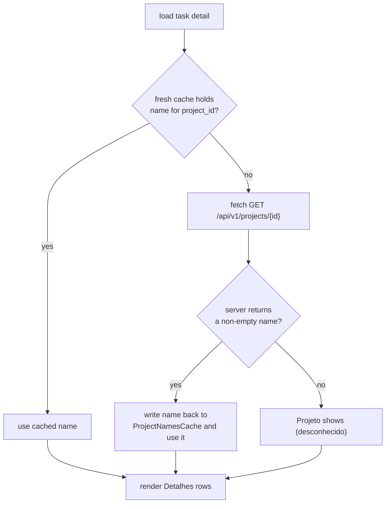

# 0030. Detail Projeto row resolved on cache miss

## Context

The detail `Detalhes` panel showed `Projeto (desconhecido)` for a task whose
project name exists on the server, because the detail load resolved the name from
the per-instance `ProjectNamesCache` alone and never fell back to the network on a
miss ([BDR 0016](/bdr/0016-detail-title-row-project-name.md) Scenario 3). This BDR
pins the corrected observable behavior decided in
[ADR 0056](/adr/0056-detail-project-name-network-fallback.md): on a miss the load
resolves the name via one `GET /api/v1/projects/{id}` and caches it. It **refines
Scenario 3 of BDR 0016** — the `Título`/`Projeto` layout of BDR 0016 is otherwise
unchanged.

## Behavior

## Textual Description

In the **TUI detail view**, inside the `Detalhes` panel, the `Projeto` row shows
the project name resolved for the task's `project_id`:

- When the per-instance project-name cache **holds a fresh name** for that id, that
  name is used and **no network request** is made.
- When the cache **has no fresh name** for that id (cold cache, stale entry, or the
  id was never listed), the load issues **one** `GET /api/v1/projects/{id}`:
  - If the server returns a **non-empty name**, the row shows that name and the name
    is **written back** to the cache (merged into the instance's map, so other
    cached names are preserved). A later detail load for the same id serves the
    name **from cache** with no further request.
  - If the server returns **no usable name** (non-200, or a missing/empty `name`),
    the row shows the existing `(desconhecido)` fallback — never a blank value.

The remaining rows (`Tarefa`, `Título`, `Status`, `Responsável`, `Início`, `Prazo`,
`Estimativa`, `Registrado`) are unchanged. The **CLI / non-TTY** path is unchanged.

## Scenarios

**Scenario 1: warm cache, no network** — Given the project-name cache holds a fresh
name `Base · Sustentação` for the task's `project_id`, When the detail loads, Then
the `Projeto` row shows `Base · Sustentação` and **no** `projects/{id}` request is
issued.

**Scenario 2: cache miss, server names the project** — Given the cache has no fresh
name for the task's `project_id` and the server returns name `Base · Sustentação`
for that project, When the detail loads, Then the `Projeto` row shows
`Base · Sustentação`, exactly **one** `GET /api/v1/projects/{id}` request is issued,
and the name is written to the cache.

**Scenario 3: resolved name is cached for next time** — Given Scenario 2 has run,
When the detail for the same task loads again, Then the `Projeto` row shows
`Base · Sustentação` served **from cache** with **zero** `projects/{id}` requests.

**Scenario 4: cache miss, server has no name** — Given the cache has no fresh name
and the server responds non-200 (or with an empty `name`) for the project, When the
detail loads, Then the `Projeto` row shows the `(desconhecido)` fallback and the
value is never blank.

## Test Design

Enrichment is exercised on the `load_task_core` load path (which injects
`project_name` before rendering) against a mocked ActiveCollab server; the client
method is unit-tested on its own for status/name mapping.

| Case | Level | Scenario | Asserts (observable) | Proves |
|---|---|---|---|---|
| Warm cache no fetch | unit | 1 | `Projeto` == cached name; zero `projects/{id}` requests | warm path unchanged |
| Miss resolves name | unit | 2 | `Projeto` == server name; exactly one `projects/{id}` request | network fallback |
| Miss writes back | unit | 3 | second load serves name with zero `projects/{id}` requests | write-back caches |
| Miss no server name | unit | 4 | `Projeto` == `(desconhecido)`; value not blank | graceful fallback |
| Client maps 200/name | unit | 2 | `fetch_project_name` → `Some(name)` on 200; `None` on non-200/empty | client contract |

## Related

- ADR: [/adr/0056-detail-project-name-network-fallback.md](/adr/0056-detail-project-name-network-fallback.md)
- ADR: [/adr/0014-browse-list-project-name-cache-swr.md](/adr/0014-browse-list-project-name-cache-swr.md)
- BDR: [/bdr/0016-detail-title-row-project-name.md](/bdr/0016-detail-title-row-project-name.md) (Scenario 3 refined here)
- Architecture: [/architecture.md](/architecture.md)
</content>
</invoke>
