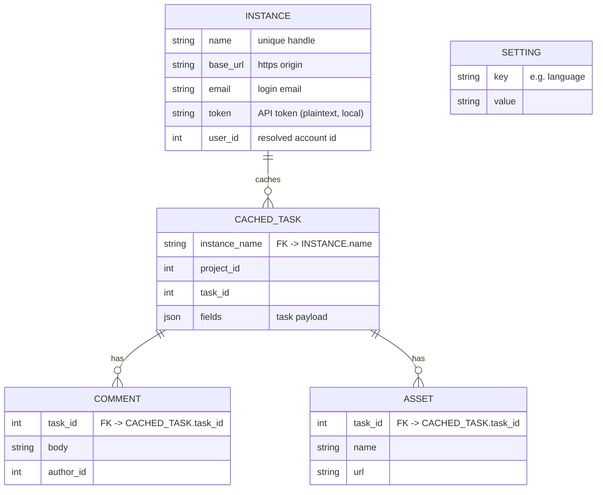

# Product Constitution

<!-- Status lives in frontmatter. Singular file — no NNNN, not indexed as a concept.
     Root of trace: every PRD/ADR/BDR/issue resolves back here. -->

## Product

`active-collab-cli` is a fast, local-first command-line tool and terminal UI
(TUI) for reading and browsing your [ActiveCollab](https://activecollab.com)
tasks across one or more instances. It is for developers who live in the
terminal and want to look up the task behind a branch, list what is assigned to
them, and browse task detail without leaving the shell.

## Scope Boundaries

**In scope:**

- A CLI with the commands `setup` (instance management), `get`, `current`
  (task from the current git branch), `mine`/`list`, and `browse` (interactive
  TUI).
- Multiple configured ActiveCollab instances, selected explicitly or inferred.
- A local SQLite cache so reads work offline and are fast.
- An interactive TUI for browsing projects → tasks → task detail, with working
  mouse, scroll, and keyboard on Linux, macOS, and Windows.
- Display internationalization (English and Brazilian Portuguese).
- Opening and downloading task assets/attachments.

**Explicitly out of scope:**

- Writing to ActiveCollab (creating/editing/commenting on tasks) — this is a
  read/browse tool.
- The git-branch-from-task helper (removed; judged low value).
- Encryption of secrets at rest — tokens are stored in the local SQLite database
  in plaintext for now (a deliberate follow-up, tracked as an ADR).
- Native pre-built macOS/Windows release binaries — the Docker build produces a
  Linux binary; native builds are a follow-up.

**Phase boundaries:**

- Phase 1: Rust rewrite to feature parity with the Python app
  ([ADR 0002](/adr/0002-rewrite-in-rust-with-ratatui.md)), built and shipped via
  Docker. Python remains the shipped app until parity is reached, then is removed.
- Phase 2: secret-at-rest encryption / OS keychain, native release builds, a
  Rust-aware CI quality gate.

## Data Model / Schema Foundation

A task is identified by the triple `(instance_name, project_id, task_id)`. The
cache is keyed on that triple; a refresh re-fetches from the instance's API and
overwrites the cached row. Settings are a flat key/value store. The same on-disk
SQLite schema is preserved across the Python→Rust rewrite so an existing user's
database keeps working.

## Non-negotiables

- **Single-binary distribution.** The shipped artifact runs with no language
  runtime, interpreter, or dependency install on the target. Falsifiable: the
  release binary runs on a clean host with nothing else installed.
- **Cross-platform input.** Mouse click, scroll, and keyboard work consistently
  on Linux, macOS, and Windows terminals. Falsifiable: over-scroll/click in the
  TUI never exits the app (the historical curses regression).
- **Token host isolation.** An instance's API token is attached only to requests
  to that instance's own host, never to any other origin (including asset URLs on
  a different host). Falsifiable: a request to a non-instance host carries no
  `Authorization`/token.
- **Local-first.** Reads are served from the local SQLite cache when present;
  the tool is usable offline against cached data. Falsifiable: a cached `get`
  succeeds with the network disabled.
- **No telemetry.** No data leaves the user's machine except requests to the
  user's own configured ActiveCollab instances.
- **Pure, testable TUI core.** The TUI state-transition logic (`update`) has no
  terminal or network dependency and is unit-tested directly. Falsifiable: the
  core test suite runs with no TTY.
- **Documentation language: English.** All docs in `docs/` are written in
  English.

## Amendment Log

<!-- Append amendments here; do not edit sections above once ratified.
     Format: ## Amendment N — YYYY-MM-DD: 
 -->
